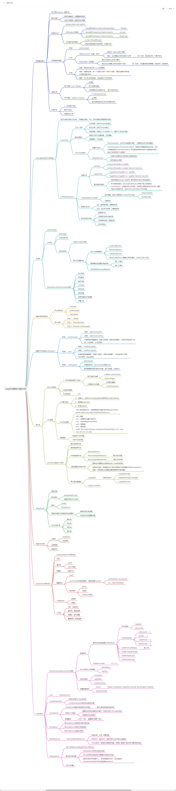

# 尚硅谷JUC新版视频教程

B站视频：https://www.bilibili.com/video/BV1ar4y1x727

百度网盘：https://pan.baidu.com/s/1qUOoZeM-HZXYGGmUp_nWEg?pwd=yyds

## 主要内容



## 知识点演进流程

### 三种创建线程池的方式

### Future方法的缺陷

线程池中的线程执行，需要返回值时候，main函数通过future.get()会阻塞main线程，严重影响效率。

### CompletableFuture

主要是4个核心的静态方法，演示位置：CompletableFutureBuildDemo.java, CompletableFutureUseDemo.java

- 案例演示：顺序执行与进程池执行.

get,getNow(),join()方法，案例 CompletableFutureAPIDemo.java

- 后续执行

thenApply,handle两个方法，案例 CompletableFutureAPI2Demo.java,一般采用thenApply().

(CompletableFuture.supplyAsync(() -> "resultA")有返回值但是不一定使用该返回值....

**thenRun**：A->B,A无返回，B无返回；

**thenAccept**：A->B,A有返回，B无返回；

**thenApply**：A->B，A有返回，B有返回；

- 使用自带线程池与指定线程池

thenRun()继续使用当前线程池,thenRunAsync新开一个线程,不指定则跳到默认的线程池；

演示：CompletableFutureWithThreadPoolDemo.java

- 从两个线程中获取值，谁先计算出就用谁的，CompletableFutureFastDemo.java

## 锁

- 悲观锁-乐观锁

- Synchronized

- 可重入锁

- 死锁

```java
jps -l

jstack 编号
```

## 线程中断

- interrupt

- interrupted

- isInterrupt


