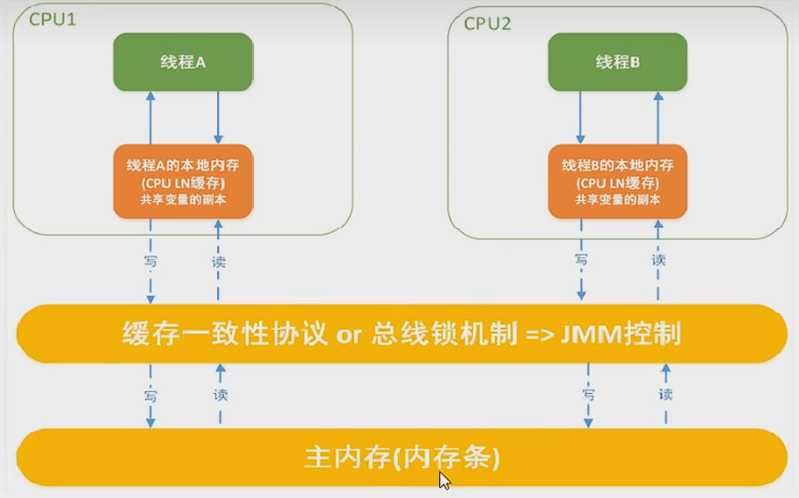
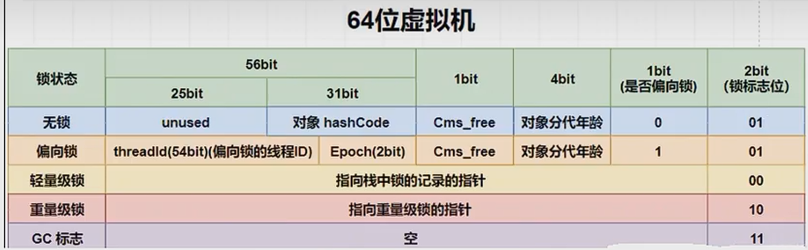
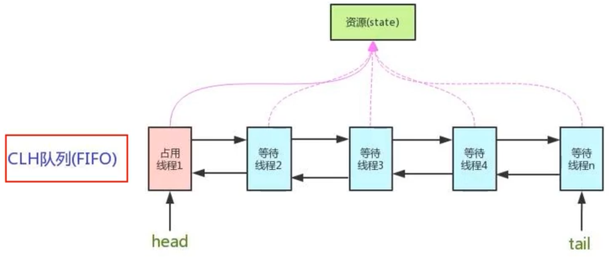
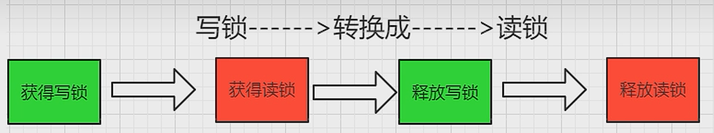

### 并发编程

并发编程的目的是为了让程序运行得更快，但是，并不是启动更多的线程就能让程序最大限度地并发执行。在进行并发编程时，如果希望通过多线程执行任务让程序运行得更快，会面临非常多的挑战，比如上下文切换的问题、死锁的问题，以及受限于硬件和软件的资源限制问题。

### 线程间通信

#### 虚假唤醒

1.

this.wait()会释放锁

this.notifyAll()

自旋(while)一下就不会虚假唤醒

2.

Lock lock = new ReentrantLock()

Condition condition = lock.newCondition()

condition.await()

condition.signal()

### 集合

#### List

- ArrayList

  线程不安全

- Vector

  线程安全

- Collections.synchronizedList()

  线程安全

- CopyOnWriteArrayList()

  写时复制技术

#### Set

- HashSet

  线程不安全

- CopyOnWriteArraySet()

  线程安全

#### Map

- HashMap

  线程不安全

- ConcurrentHashMap

  线程安全

### 并发容器

#### ConcurrentHashMap

ConcurrentHashMap使用了**锁分段技术**，就是每一把锁只锁其中一部分数据。

ConcurrentHashMap是由Segment数组结构和HashEntry数组结构组成。

#### ConcurrentLinkedQueue

CAS实现

### 线程池

线程池(thread pool) ：一种线程使用模式。线程过多会带来调度开销，进而影响缓存局部性和整体性能。而线程池维护着多个线程，等待着监督管理者分配可并发执行的任务。这避免了在处理短时间任务时创建与销毁线程的代价。线程池不仅能够保证内核的充分利用，还能防止过分调度。

**特点：**

- 降低资源消耗：通过重复利用已创建的线程降低线程创建和销毁造成的销耗。
- 提高响应速度：当任务到达时，任务可以不需要等待线程创建就能立即执行。
- 提高线程的可管理性：线程是稀缺资源，如果无限制的创建，不仅会销耗系统资源，还会降低系统的稳定性，使用线程池可以进行统一的分配，调优和监控。

#### 线程池使用方式

都使用了ThreadPoolExecutor

```java
public class ThreadPoolTest {
    public static void main(String[] args) {
        //一池五线程
        ExecutorService threadPool = Executors.newFixedThreadPool(5);
        for (int i = 0; i < 10; i++) {
            threadPool.execute(() -> {
                System.out.println(Thread.currentThread().getName() + "\t" + "办理业务");
            });
        }
        threadPool.shutdown();
        //一池一线程
        ExecutorService singleThreadExecutor = Executors.newSingleThreadExecutor();
        for (int i = 0; i < 10; i++) {
            singleThreadExecutor.execute(() -> {
                System.out.println(Thread.currentThread().getName() + "\t" + "办理业务");
            });
        }
        singleThreadExecutor.shutdown();
        //一池可扩容
        ExecutorService cachedThreadPool = Executors.newCachedThreadPool();
        for (int i = 0; i < 10; i++) {
            cachedThreadPool.execute(() -> {
                System.out.println(Thread.currentThread().getName() + "\t" + "办理业务");
            });
        }
        cachedThreadPool.shutdown();
    }
}
```

#### ThreadPoolExecutor

**七个参数**

- int corePoolSize 常驻线程数量
- int maximumPoolSize 最大线程数量
- long keepAliveTime， TimeUnit unit 线程存活时间，后面为单位
- BlockingQueue<Runnable> workQueue 阻塞对列
- ThreadFactory threadFactory 线程工厂
- RejectedExecutionHandler handler 拒绝策略
  - 抛出异常
  - 调用者运行
  - 抛弃等待最久的任务
  - 不做处理

#### 自定义线程池

一般使用自定义线程池

### 多线程编程

实现线程方式：

- 继承Thread类

- 实现Runnable接口

使用了静态代理

```java
//优先使用，java单个继承、多个实现
class Threadtest implements Runnable {
    //实现run方法
}
new Thread(new Threadtest()).start();
```

- 实现Callable接口

可以有返回值，可以抛出异常

```java
class Threadtest implements Callable<Object> {
    //实现call方法
}
//创建执行服务:
ExecutorService ser = Executors.newFixedThreadPool(1);
//提交执行
Future<Object> r1 = ser.submit(new Threadtest());
//获取结果
Object rs1 = r1.get();
ser.shutdown();
```

- 线程池

### 守护线程

默认都是用户线程，守护线程是为其他线程服务的。

```java
new Thread().setDaemon(true);//设置为守护线程 必须在start之前设置
//GC线程就是一个守护线程
```

### Future

Future接口(FutureTask实现类)定义了操作异步任务执行一些方法，如获取异步任务的执行结果、取消任务的执行、判断任务是否被取消、判断任务执行是否完毕等。

#### FutureTask

集成了：多线程，有返回值，异步，Callable注入，抛出异常，是Future的实现类

```java
public static void main(String[] args) {

        FutureTask<String> futureTask = new FutureTask<>(new Callable<String>() {
            @Override
            public String call() throws Exception {
                Thread.sleep(2000);
                return "你好";
            }
        });
        new Thread(futureTask).start();
        try {
            System.out.println("会阻塞吗?");//get方法会阻塞等待结果
            System.out.println(futureTask.get());
        } catch (InterruptedException e) {
            e.printStackTrace();
        } catch (ExecutionException e) {
            e.printStackTrace();
        }
    }
```

#### 优点

Future + 线程池异步多线程任务配合，能显著提高程序的执行效率。

#### 缺点

- get方法容易导致阻塞，一般建议放在程序最后，当然可以设置超时时间。

- 轮循容易导致CPU空转

```java
FutureTask<String> futureTask = new FutureTask<>(new Callable<String>() {
            @Override
            public String call() throws Exception {
                Thread.sleep(4000);
                return "你好";
            }
        });
        new Thread(futureTask).start();
        try {
            System.out.println("会阻塞吗?");
            while (true) {
                if (futureTask.isDone()) {
                    System.out.println(futureTask.get());
                    break;
                } else {
                    //暂停防止轮循
                    Thread.sleep(1000);
                    System.out.println("正在访问结果...");
                }
            }
        } catch (InterruptedException e) {
            e.printStackTrace();
        } catch (ExecutionException e) {
            e.printStackTrace();
        }
```

Future对于结果的获取不是很友好，只能通过阻塞或轮询的方式得到任务的结果。

### CompletableFuture

针对Future缺点，提出了CompletableFuture

对于真正的异步处理我们希望是可以通过传入回调函数，在Future结束时自动调用该回调函数，这样，我们就不用等待结果。

阻塞的方式和异步编程的设计理念相违背，而轮询的方式会耗费无谓的CPU资源。因此，JDK8设计出CompletableFuture。

CompletableFuture提供了一种观察者模式类似的机制，可以让任务执行完成后通知监听的一方。

#### CompletionStage

- CompletionStage代表异步计算过程中的某一个阶段，一个阶段完成以后可能会触发另外一个阶段
- 一个阶段的计算执行可以是一-个Function, Consumer或者Runnable。 比如: stage.thenApply(x -> square()).thenAccept(X -> System.out.print()).thenRun(O -> System.out.println()
- 一个阶段的执行可能是被单个阶段的完成触发，也可能是由多个阶段一起触发

代表异步计算过程中的某一个阶段，一个阶段完成以后可能会触发另外一个阶段，有些类似Linux系统的管道分隔符传参数。

**该接口方法**

```java
getNow("xxxx")//未完成，立即返回xxxx

complete("xxxx")//是否打断get/join方法，打断get/join就立即返回xxxx
    

//thenApply
ExecutorService threadPool = Executors.newFixedThreadPool(3);
CompletableFuture.supplyAsync(() -> {
	System.out.println(1);
	return 1;
}, threadPool).thenApply(f -> {
	System.out.println(2);
	return 2 + f;
});
threadPool.shutdown();

//handle 出错了可以往下走
ExecutorService threadPool = Executors.newFixedThreadPool(3);
CompletableFuture.supplyAsync(() -> {
	System.out.println(1);
	return 1;
}, threadPool).handle((f, e) -> {
	System.out.println(1/0);;
	System.out.println(2);
	return 2 + f;
}).handle((f, e) -> {
	System.out.println(3);
	return 3 + f;
}).whenComplete((v, e) -> {
	if (e == null) {
		System.out.println(v);
	}
}).exceptionally(e -> {
	e.printStackTrace();
	System.out.println(e.getMessage());
	return null;
});
threadPool.shutdown();

//thenAccept 接收任务处理结果，并消费处理，无返回结果
ExecutorService threadPool = Executors.newFixedThreadPool(3);
CompletableFuture.supplyAsync(() -> {
	return 1;
}, threadPool).thenApply((f) -> {
	return 2 + f;
}).thenAccept(r -> {
	System.out.println(r);
});
threadPool.shutdown();

//thenRun 方法无返回值，其他方法对它无影响
ExecutorService threadPool = Executors.newFixedThreadPool(3);
System.out.println(CompletableFuture.supplyAsync(() -> {return 1;}, threadPool).thenRun(() -> {}).join());;
threadPool.shutdown();

//applyToEither判断谁快
ExecutorService threadPool = Executors.newFixedThreadPool(3);
CompletableFuture<Integer> cf1 = CompletableFuture.supplyAsync(() -> {
	try {
		Thread.sleep(1000);
	} catch (InterruptedException e) {
		e.printStackTrace();
	}
	System.out.println(1);
	return 1;
}, threadPool);
CompletableFuture<Integer> cf2 = CompletableFuture.supplyAsync(() -> {
	System.out.println(2);
	return 2;
}, threadPool);
CompletableFuture<String> res = cf1.applyToEither(cf2, f -> {
	return f + " is winer";
});
System.out.println(res.join());
threadPool.shutdown();

//thenCombine结果合并
CompletableFuture<Integer> res = cf1.thenCombine(cf2, (x, y) -> {
	System.out.println("join");
	return x + y;
});
System.out.println(res.join());
```

#### 核心静态方法

推荐用这些方法创建CompletableFuture

**runAsync无返回值**

```java
public static CompletableFuture<Void> runAsync(Runnable runnable)
public static CompletableFuture<Void> runAsync(Runnable runnable, Executor executo)
    

ExecutorService threadPool = Executors.newFixedThreadPool(3);
CompletableFuture<Void> completableFuture = CompletableFuture.runAsync(() -> {
	System.out.println(Thread.currentThread().getName());
}, threadPool);
System.out.println(completableFuture.get());
threadPool.shutdown();
```

**supplyAsync有返回值**

```java
public static <U> CompletableFuture<U> supplyAsync(Supplier<U> supplier)
public static <U> CompletableFuture<U> supplyAsync(Supplier<U> supplier, Executor executor)//没有指定线程池，用默认
    
ExecutorService threadPool = Executors.newFixedThreadPool(3);
CompletableFuture<String> completableFuture = CompletableFuture.supplyAsync(() -> {
	System.out.println(Thread.currentThread().getName());
	return "hello";
}, threadPool);
System.out.println(completableFuture.get());
threadPool.shutdown();
```

从Java8开始引入了CompletableFuture，它是Future的功能增强版，减少阻塞和轮询可以传入回调对象，
当异步任务完成或者发生异常时，自动调用回调对象的回调方法。

```java
//不用使用get阻塞接收
ExecutorService threadPool = Executors.newFixedThreadPool(3);

CompletableFuture<String> completableFuture = CompletableFuture.supplyAsync(() -> {
	System.out.println(Thread.currentThread().getName() + "come in");
	//System.out.println(1/0);
}, threadPool).whenComplete((r, e) -> {
//自动监听任务是否完成任务
if (e == null) {
	System.out.println("get result: " + r);
}
}).exceptionally(e -> {
//任务出现异常时执行
	e.printStackTrace();
	System.out.println("error: " + e.getCause() + "\t" + e.getMessage());
	return null;
});

threadPool.shutdown();
```

主线程结束时，CompletableFuture默认使用的线程池会立刻关闭，建议使用自定义线程池，并手动关闭。

**Lambda表达式+Stream流式调用+Chain链式调用+Java8函数式接口**

| 函数式接口名称 | 方法名称 | 参数     | 返回值   |
| -------------- | -------- | -------- | -------- |
| Runnable       | run      | 无参数   | 无返回值 |
| Function       | apply    | 1个参数  | 有返回值 |
| Consume        | accept   | 1个参数  | 无返回值 |
| Supplier       | get      | 没有参数 | 有返回值 |
| BiConsumer     | accept   | 2个参数  | 无返回值 |

join()与get()类似，只是前者不抛出异常

### 锁

#### 悲观锁

认为自己在使用数据的时候一定有别的线程来修改数据，因此在获取数据的时候会先加锁，确保数据不会被别的线程修改，**synchronized**关键字和**Lock**的实现类都是悲观锁，适应写操作频繁的场景。

#### 乐观锁

认为自己在使用数据时不会有别的线程修改数据或资源，所以不会添加锁。
在Java中是通过使用无锁编程来实现，只是在更新数据的时候去判断，之前有没有别的线程更新了这个数据。

如果这个数据没有被更新，当前线程将自己修改的数据成功写入。
如果这个数据已经被其它线程更新，则根据不同的实现执行不同的操作，比如放弃修改、重试抢锁等等

**判断规则**

- 版本号机制
- CAS算法

适合读频繁的场景

#### synchronized

**synchronized使用的三种方式：**

- 作用于实例方法，当前实例加锁，进入同步代码前要获得当前实例的锁。

  调用指令将会检查方法的ACC_SYNCHRONIZED访问标志是否被设置。如果设置了，执行线程会将先持有monitor锁，然后再执行方法，最后在方法完成(无论是正常完成还是非正常完成)时释放monitor

- 作用于代码块，对括号里配置的对象加锁。

  synchronized同步代码块实现使用的是monitorenter和monitorexit指令，来保证持有锁，释放锁。会而外多加一个monitorexit，为了出现异常时也能释放锁。

- 作用于静态方法，当前类加锁，进去同步代码前要获得当前类对象的锁。

  ACC_STATIC，ACC_SYNCHRONIZED访问标志区分该方法是否静态同步方法

**为什么任何一个对象都能成为一个锁呢？**

objectMonitor.java -> objectMonitor.cpp -> objectMonitor.hpp

因为monitor采用objectMonitor实现的

**什么是管程monitor**

管程(英语: Monitors, 也称为监视器)是一种程序结构，结构内的多个子程序(对象或模块)形成的多个工作线程互斥访问共享资源。
这些共享资源一般是硬件设备或一群变量。对共享变量能够进行的所有操作集中在一个模块中。(把信号量及其操作原语“封装”在一个对象内部)
管程实现了在一个时间点， 最多只有一个线程在执行管程的某个子程序。管程提供了一种机制，管程可以看做一个软件模块，它是将共享的变量和对于这些共享变量的操作封装起来，形成一个具有一定接口的功能模块，进程可以调用管程来实现进程级别的并发控制。

```java
class Phone {
    public synchronized void sendEmail() {
        try {
            TimeUnit.SECONDS.sleep(2);
        } catch (InterruptedException e) {
            e.printStackTrace();
        }
        System.out.println("----sendEmail");
    }
    public synchronized void sendSMS() {
        try {
            TimeUnit.SECONDS.sleep(1);
        } catch (InterruptedException e) {
            e.printStackTrace();
        }
        System.out.println("-----sendSMS");
    }
    public void hello() {
        System.out.println("-------he11o");
    }
}
public class JucTest {
    public static void main(String[] args) {
        Phone p1 = new Phone();
        Phone p2 = new Phone();
        new Thread(() -> {
            p1.sendEmail();
        }).start();
        
        new Thread(() -> {
            p1.sendSMS();
        }).start();
    }
}
```

先Email，后SMS

一个对象里面如果有多个synchronized方法，某一个时刻内， 只要一个线程去调用其中的一个synchronized方法了，其它的线程都只能等待，换句话说，某一个时刻内， 只能有唯一的一 个线程去访间这些synchronized方法。

锁的是当前对象this，被锁定后，其它的线程都不能进入到当前对象的其它的synchronized方法。

```java
public class JucTest {
    public static void main(String[] args) {
        Phone p1 = new Phone();
        Phone p2 = new Phone();
        new Thread(() -> {
            p1.sendEmail();
        }).start();
        
        new Thread(() -> {
            p1.hello();
        }).start();
    }
}
```

先hello，后Email

普通方法与同步锁无关

```java
public class JucTest {
    public static void main(String[] args) {
        Phone p1 = new Phone();
        Phone p2 = new Phone();
        new Thread(() -> {
            p1.sendEmail();
        }).start();
        new Thread(() -> {
            p2.sendSMS();
        }).start();
    }
}
```

先SMS，后Email

不是同一把锁

```java
class Phone {
    public static synchronized void sendEmail() {
        try {
            TimeUnit.SECONDS.sleep(2);
        } catch (InterruptedException e) {
            e.printStackTrace();
        }
        System.out.println("----sendEmail");
    }
    public static synchronized void sendSMS() {
        try {
            TimeUnit.SECONDS.sleep(1);
        } catch (InterruptedException e) {
            e.printStackTrace();
        }
        System.out.println("-----sendSMS");
    }
    public void hello() {
        System.out.println("-------he11o");
    }
}
public class JucTest {
    public static void main(String[] args) {
        Phone p1 = new Phone();
        Phone p2 = new Phone();
        new Thread(() -> {
            p1.sendEmail();
        }).start();
        new Thread(() -> {
            p1.sendSMS();
        }).start();
    }
}
```

先Email，后SMS

```java
public class JucTest {
    public static void main(String[] args) {
        Phone p1 = new Phone();
        Phone p2 = new Phone();
        new Thread(() -> {
            p1.sendEmail();
        }).start();
        new Thread(() -> {
            p2.sendSMS();
        }).start();
    }
}
```

先Email，后SMS

上述两种情况，加的是类锁

对F普通同步方法，锁的是当前实例对象，通常指this，具体的一部部手机，所有的普通同步方法用的都是同把锁->实例对象本身，对于静态同步方法， 锁的是当前类的Class对象， 如Phone.class唯的一 个模板对于同步方法块，锁的是synchronized括号内的对象。

```java
class Phone {
    public static synchronized void sendEmail() {
        try {
            TimeUnit.SECONDS.sleep(2);
        } catch (InterruptedException e) {
            e.printStackTrace();
        }
        System.out.println("----sendEmail");
    }
    public synchronized void sendSMS() {
        try {
            TimeUnit.SECONDS.sleep(1);
        } catch (InterruptedException e) {
            e.printStackTrace();
        }
        System.out.println("-----sendSMS");
    }
    public void hello() {
        System.out.println("-------he11o");
    }
}
public class JucTest {
    public static void main(String[] args) {
        Phone p1 = new Phone();
        Phone p2 = new Phone();
        new Thread(() -> {
            p1.sendEmail();
        }).start();
        new Thread(() -> {
            p1.sendSMS();
        }).start();
    }
}
```

先SMS，后Email

前者为类锁，后者为对象锁

```java
public class JucTest {
    public static void main(String[] args) {
        Phone p1 = new Phone();
        Phone p2 = new Phone();
        new Thread(() -> {
            p1.sendEmail();
        }).start();
        new Thread(() -> {
            p2.sendSMS();
        }).start();
    }
}
```

先SMS，后Email

上述两种情况：当个线程试图访问同步代码时 它直先必须得到锁，正常退出或抛出异常时必须释放锁。
所有的普通同步方法用的都是同一把锁一实例对象本身，就是new出来的具体实例对象本身，本类this也就是说如果一个实例对象的普通同步方法获取锁后，该实例对象的其他普通同步方法必须等待获取锁的方法释放锁后才能获取锁。
所有的静态同步方法用的也是同一把锁一类对象本身，就是我们说过的唯一模板Class
具体实例对象this和唯一模板class, 这两把锁是两个不同的对象，所以静态同步方法与普通同步方法之间是不会有竞态条件的但是一旦一个静态同步方法获取锁后，其他的静态同步方法都必须等待该方法释放锁后才能获取锁。

#### 公平锁

是指多个线程按照申请锁的顺序来获取锁，这里类似排队买票，先来的人先买后来的人在队尾排着，这是公平的。

Lock lock = new ReentrantLock(true)

#### 非公平锁

是指多个线程获取锁的顺序并不是按照申请锁的顺序，有可能后申请的线程比先申请的线程优先获取锁，在高并
发环境下，有可能造成优先级翻转或者饥饿的状态(某个线程一直得不到锁)。

Lock lock = new ReentrantLock(false)

Lock lock = new ReentrantLock()//默认非公平锁

- 恢复挂起的线程到真正锁的获取还是有时间差的，从开发人员来看这个时间微乎其微，但是从CPU的角度来看，这个时间差存在的还是很明显的。所以非公平锁能更充分的利用CPU的时间片，尽量减少CPU空闲状态时间。
- 使用多线程很重要的考量点是线程切换的开销，当采用非公平锁时，当1个线程请求锁获取同步状态，然后释放同步状态，所以刚释放锁的线程在此刻再次获取同步状态的概率就变得非常大，所以就减少了线程的开销。

- 非公平锁线程切换开销大。

#### 可重入锁又名递归锁

ReentrantLock 和 synchronized都是可重入锁

是指在同一个线程在外层方法获取锁的时候，再进入该线程的内层方法会自动获取锁(前提，锁对象得是同一个对 象)，不会因为之前已经获取过还没释放而阻塞。

**隐式锁（synchronized）**

默认就是可重入锁

在一个synchronized修饰的方法或代码块的内部调用本类的其他synchronized修饰的方法或代码块时，是永远可以得到锁的

```java
public class JucTest {
    public static void main(String[] args) {
        reEntryM1();
    }

    private static void reEntryM1() {
        final Object object = new Object();
        new Thread(() -> {
            synchronized (object){
                System. out . println(Thread.currentThread(). getName()+"\t ---外层调用");
                synchronized (object){
                    System. out . println(Thread. currentThread(). getName()+"\t ----中层调用");
                    synchronized (object){
                        System. out . println( Thread.currentThread(). getName()+"\t ----内层调用");
                    }
                }
            }
        }, "t1"). start();
    }
}
```

```java
public class JucTest {
    public static void main(String[] args) {
        new Thread(() -> {
            new JucTest().m1();
        }).start();
    }
    public synchronized void m1() {
        //指的是可重复可递归调用的锁，在外层使用锁之后，在内层仍然可以使用，并且不发生死锁，这样的锁就叫做可重入
        System.out.println(Thread.currentThread().getName()+"\t ----come in");
        m2();
        System.out.println(Thread.currentThread().getName()+"\t ----end m1");
    }
    public synchronized void m2(){
        System.out.println(Thread.currentThread().getName()+"\t ----come in");
        m3();
    }
    public synchronized void m3() {
        System.out.println(Thread.currentThread(). getName()+"\t ----come in");
    }

}
```

**显示锁（ReentrantLock）**

显示指定lock() unlock()

加锁几次就要解锁几次，必须严格使用锁次数与释放锁次数对应。

```java
public class JucTest {
    static Lock lock = new ReentrantLock();
    public static void main(String[] args) {
        new Thread(() -> {
            lock.lock();
            try {
                System.out.println(Thread.currentThread().getName()+"\t ----come in外层调用");
                lock.lock();
                try {
                    System.out.println(Thread.currentThread().getName()+"\t ----come in内层调用");
                }finally {
                    lock.unlock();
                }
            }finally {
                lock.unlock();
            }
        }, "t1").start();
    }
}
```

#### 死锁

死锁是指两个或两个以上的线程在执行过程中，因争夺资源而造成的一种互相等待的现象，若无外力干涉那它们都将无法推进下去，如果系统资源充足，进程的资源请求都能够得到满足，死锁出现的可能性就很低，否则就会因争夺有限的资源而陷入死锁。

```java
//死锁代码
public class JucTest {
    public static void main(String[] args) {
        final Object objectA = new Object();
        final Object objectB = new Object();
        new Thread(() -> {
            synchronized (objectA) {
                System.out.println(Thread.currentThread().getName() + "\t自己持有A锁，希望获得B锁");
                try {
                    TimeUnit.SECONDS.sleep(1);
                } catch (InterruptedException e) {
                    e.printStackTrace();
                }
                synchronized (objectB) {
                    System.out.println(Thread.currentThread().getName() + "\t成功获得B锁");
                }
            }
        }, "A").start();

        new Thread(() -> {
            synchronized (objectB) {
                System.out.println(Thread.currentThread().getName() + "\t自己持有B锁，希望获得A锁");
                try {
                    TimeUnit.SECONDS.sleep(1);
                } catch (InterruptedException e) {
                    e.printStackTrace();
                }
                synchronized (objectA) {
                    System.out.println(Thread.currentThread().getName() + "\t成功获得A锁");
                }
            }
        }, "B").start();
    }
}
```

**排查死锁**

```java
# 纯命令
jps -l
jstack 进程编号

# jconsole图形化界面
```

### 中断机制


**协商中断**

首先一个线程不应该由其他线程来强制中断或停止，而是应该由线程自己自行停止，自己来决定自己的命运。

所以，Thread.stop，Thread.suspend，Thread.resume都已经被废弃了。

其次在Java中没有办法立即停止一条线程，然而停止线程却显得尤为重要，如取消一个耗时操作。
因此，Java提供了一种用于停止线程的协商机制-----中断，也即中断标识协商机制。
中断只是一种协作协商机制，Java没 有给中断增加任何语法，中断的过程完全需要程序员自己实现。
若要中断一个线程，你需要手动调用该线程的interrupt方法，该方法也仅仅是将线程对象的中断标识设成true

接着你需要自己写代码不断地检测当前线程的标识位，如果为true，表示别的线程请求这条线程中断，此时究竟该做什么需要你自己写代码实现。
每个线程对象中都有一个中断标识位，用于表示线程是否被中断;该标识位为true表示中断，为false表示未中断;
通过调用线程对象的interrupt方法将该线程的标识位设为true;可以在别的线程中调用，也可以在自己的线程中调用。

如何实现线程中断停止

```java
//1.使用volatile共享变量
public class JucTest {
    static volatile boolean isStop = false;
    public static void main(String[] args) {

        new Thread(() -> {
            while (true) {
                if (isStop) {
                    System.out.println(Thread.currentThread().getName() + "\t" + "thread stop");
                    break;
                }
                System.out.println("t1 -------hello volatile");
            }
        }, "t1").start();

        try {
            TimeUnit.MICROSECONDS.sleep(20);
        } catch (InterruptedException e) {
            e.printStackTrace();
        }
        new Thread(() -> {
            isStop = true;
        }, "t2").start();
    }
}

//使用原子类
public class JucTest {
    static AtomicBoolean atomicBoolean = new AtomicBoolean(false);
    public static void main(String[] args) {

        new Thread(() -> {
            while (true) {
                if (atomicBoolean.get()) {
                    System.out.println(Thread.currentThread().getName() + "\t" + "thread stop");
                    break;
                }
                System.out.println("t1 -------hello volatile");
            }
        }, "t1").start();

        try {
            TimeUnit.MICROSECONDS.sleep(20);
        } catch (InterruptedException e) {
            e.printStackTrace();
        }
        new Thread(() -> {
            atomicBoolean.set(true);
        }, "t2").start();
    }
}
```

通过线程自带的**中断API**实列方法实现

- Thread.interrupt()

  没有返回值

  仅仅是设置线程的中断状态为true，发起一个协商而不会立刻停止线程

  ①如果线程处于正常活动状态，那么会将该线程的中断标志设置为true，仅此而已。被设置中断标志的线程将继续正常运行，不受影响。所以，interrupt() 并不能真正的中断线程，需要被调用的线程自己进行配合才行。
  ②如果线程A处于被阻塞状态( 例如处于sleep， wait， join等状态)，在别的线程B中调用当前线程对象A的interrupt方法，那么线程A将立即退出被阻塞状态，中断状态将被清除，并抛出一个InterruptedException异常，若A在循环中不会中断，仍会继续执行。（可能程序会无限循环，解决方法须在异常catch处再调用interrupt方法）

- Thread.interrupted()

  1. 返回当前线程的中断状态，true表示当前的状态为中断，false表示没有中断；

  2. 将当前线程的中断状态清零，也就是说重置为false，清除线程的中断状态；

- Thread.isInterrupted()

  判断当前线程是否被中断(通过检查中断标志位)，不清除线程的中断状态，若不存在返回false。

```java
//通过线程自带的中断API实列方法实现
public class JucTest {
    public static void main(String[] args) {
        Thread t1 = new Thread(() -> {
            while (true) {
                if (Thread.currentThread().isInterrupted()) {
                    System.out.println(Thread.currentThread().getName() + "\t" + "thread stop");
                    break;
                }
                System.out.println("t1 -------hello volatile");
            }
        }, "t1");
        t1.start();

        try {
            TimeUnit.MICROSECONDS.sleep(10);
        } catch (InterruptedException e) {
            e.printStackTrace();
        }
        new Thread(() -> {
            t1.interrupt();
        }, "t2").start();
    }
}
```

### LockSupport

线程的等待和唤醒

- 使用Object中的wait()方法让线程等待，使用Object中的notify()方法唤醒线程，使用必须持有锁，也就是说必须写在锁块内。

```java
//wait必须在notify前面执行.
private static void syncWaitNotify() {
    // 必须先wait再notify,不然唤醒无效.
    // 演示无效只需要将2修改为1即可；
    Object objectLock = new Object();

    new Thread(() -> {
        try {
            TimeUnit.SECONDS.sleep(1);
        } catch (InterruptedException e) {
            e.printStackTrace();
        }
        synchronized (objectLock) {
            System.out.println(Thread.currentThread().getName() + "\t ----come in");
            try {
                objectLock.wait();
            } catch (InterruptedException e) {
                e.printStackTrace();
            }
            System.out.println(Thread.currentThread().getName() + "\t ----被唤醒");
        }
    }, "t1").start();

    // 演示无效只需要将2修改为1即可；
    try {
        TimeUnit.SECONDS.sleep(2);
    } catch (InterruptedException e) {
        e.printStackTrace();
    }

    new Thread(() -> {
        synchronized (objectLock) {
            objectLock.notify();
            System.out.println(Thread.currentThread().getName() + "\t ----发出通知");
        }
    }, "t2").start();
}
```

- 使用JUC包中Condition的await()方法让线程等待，使用signal()方法唤醒线程，使用必须持有锁，也就是说必须写在锁块内。

```java
//先await() 后signal
private static void lockAwaitSignal() {

    // 必须先wait再notify,不然唤醒无效.
    // 演示无效只需要将2修改为1即可.
    
    Lock lock = new ReentrantLock();
    Condition condition = lock.newCondition();

    new Thread(() -> {
        try {
            TimeUnit.SECONDS.sleep(1);
        } catch (InterruptedException e) {
            e.printStackTrace();
        }
        lock.lock();
        try {
            System.out.println(Thread.currentThread().getName() + "\t ----come in");
            condition.await();
            System.out.println(Thread.currentThread().getName() + "\t ----被唤醒");
        } catch (InterruptedException e) {
            e.printStackTrace();
        } finally {
            lock.unlock();
        }
    }, "t1").start();

    // 演示必须先condition.await，后condition.signal();
    try {
        TimeUnit.SECONDS.sleep(2);
    } catch (InterruptedException e) {
        e.printStackTrace();
    }

    new Thread(() -> {
        lock.lock();
        try {
            condition.signal();
            System.out.println(Thread.currentThread().getName() + "\t ----发出通知");
        } finally {
            lock.unlock();
        }
    }, "t2").start();
}
```

- LockSupport类可以park阻塞当前线程以及unpark唤醒指定被阻塞的线程，

```java
//park unpark 无顺序要求。因为park发了许可证，线程没使用，会保留，许可证不会积累，最多只有一个.

private static void parkAndUnpark() {
    Thread t1 = new Thread(() -> {
        try {
            TimeUnit.SECONDS.sleep(2);
        } catch (InterruptedException e) {
            e.printStackTrace();
        }
        System.out.println(Thread.currentThread().getName() + "\t ----come in" + System.currentTimeMillis());
        LockSupport.park();
        System.out.println(Thread.currentThread().getName() + "\t ----被唤醒" + System.currentTimeMillis());
    }, "t1");
    t1.start();

    try {
        TimeUnit.SECONDS.sleep(2);
    } catch (InterruptedException e) {
        e.printStackTrace();
    }

    // unpark后执行仍然不会报错.

    new Thread(() -> {
        LockSupport.unpark(t1);
        System.out.println(Thread.currentThread().getName() + "\t ----发出通知");
    }, "t2").start();
}
```

### JAVA内存模型（JMM）

CPU的运行并不是直接操作内存而是先把内存里边的数据读到缓存，而内存的读和写操作的时候就会造成不一致的问题。

JVM规范中试图定义一种Java内存模型(java Memory Model，简称JMM)来屏蔽掉各种硬件和操作系统的内存访问差异，以实现让Java程序在各种平台下都能达到一致的内存访问效果。

JMM(Java内存模型Java Memory Model，简称JMM)本身是一种抽象的概念并不真实存在它仅仅描述的是一组约定或规范，通过这组规范定义了程序中(尤其是多线程)各个变量的读写访问方式并决定一个线程对共享变量的写入何时以及如何变成对另一个线程可见，关键技术点都是围绕多线程的原子性、可见性和有序性展开的。

**作用：**

通过JMM来实现线程和主内存之间的抽象关系。
屏蔽各个硬件平台和操作系统的内存访问差异以实现让Java程序在各种平台下都能达到一致的内存访问效果。

#### 三大特性

**可见性**

是指当一个线程修改了某一个共享变量的值，其他线程是否能够立即知道该变更，JMM规定了所有的变量都存储在主内存中。

**原子性**

指一个操作是不可打断的，即多线程环境下，操作不能被其他线程干扰。

**有序性**

指令重排

JVM能根据处理器特性(CPU多 级缓存系统、多核处理器等)适当的对机器指令进行重排序，使机器指令能更符合CPU的执行特性，最大限度的发挥机器性能。但是，指令重排可以保证串行语义一致，但没有义务保证多线程间的语义也一致(即可能产生"脏读")， 简单说，两行以上不相干的代码在执行的时候有可能先执行的不是第一条， 不见得是从上到下顺序执行，执行顺序会被优化。


#### 多线程对变量的读写过程

(读取赋值等)必须在工作内存中进行，首先要将变量从主内存拷贝到的线程自己的工作内存空间，然后对变量进行操作，操作完成后再将变量写回主内存，不能直接操作主内存中的变量，各个线程中的工作内存中存储着主内存中的变量副本拷贝，因此不同的线程间无法访问对方的工作内存，线程间的通信(传值)必须通过主内存来完成，其简要访问过程如下图:



#### 先行发生原则

**happens-before**

在JMM中，如果一个操作执行的结果需要对另一个操作可见性或者代码重排序，那么这两个操作之间必须存在happens-before(先行发生)原则。

如果一个操作happens-before另一个操作，那么第一个操作的执行结果将对第二个操作可见，而且第一个操作的执行顺序排在第二个操作之前。
两个操作之间存在happens-before关系，并不意味着一定要按照happens-before原则制定的顺序来执行。
如果重排序之后的执行结果与按照happens-before关系来执行的结果一致，那么这种重排序并不非法。

**八条**

- 次序规则

  同一线程中，前一个操作的结果可以被后续的操作获取。讲白点就是前面一个操作把变量X赋值为1，那后面一个操作肯定能知道X已经变成了1。

- 锁定规则

  一个unLock操作先行发生于后面 (这里的“后面”是指时间上的先后) 对同一个锁的Iock操作。

- volatile变量规则

  对一个volatile变量的写操作先行发生于后面对这个变量的读操作，前面的写对后面的读是可见的，这里的”后面"同样是指时间上的先后。

- 传递规则

  如果操作A先行发生于操作B，而操作B又先行发生于操作C，则可以得出操作A先行发生于操作C;

- 线程启动规则（Thread Start Rule）

  Thread对象的start()方法先行发生于此线程的每一个动作

- 线程中断规则(Thread Interruption Rule)

  对线程interrupt()方法的调用先行发生于被中断线程的代码检测到中断事件的发生
  可以通过Thread.interrupted()检测到是否发生中断
  也就是说你要先调用interrupt()方法设置过中断标志位，我才能检测到中断发送。

- 线程终止规则(Thread Termination Rule)

  线程中的所有操作都先行发生于对此线程的终止检测，我们可以通过isAlive()等手段检测线程是否已经终止执行。

- 对象终结规则(Finalizer Rule)

  一个对象的初始化完成(构造函数执行结束)先行发生于它的finalize()方法的开始

### volatile

被volatile修饰的变量有两大特性：可见性，有序性（禁重排）

可见性：保证不同线程对某个变量完成操作后结果及时可见，即该共享变量一旦改变所有线程立即可见。

1. 当写一个volatile变量时，JMM会把该线程对应的本地内存中的共享变量值立即刷新回主内存中，并及时发出通知，大家可以去主内存拿最新版，前面的修改对后面所有线程可见。
2. 当读一个volatile变量时，JMM会把该线程对应的本地内存设置为无效，重新回到主内存中读取最新共享变量，所以volatile的写内存语义是直接刷新到主内存中，读的内存语义是直接从主内存中读取。

怎么保证可见性，有序性：**内存屏障**

#### 内存屏障

内存屏障(也称内存栅栏，屏障指令等，是一类同步屏障指令，是CPU或编译器在对内存随机访问的操作中的一个同步点，使得此点之前的所有读写操作都执行后才可以开始执行此点之后的操作)，避免代码重排序。内存屏障其实就是一种JVM指令，Java内存模型的重排规则会要求Java编译器在生成JVM指令时插入特定的内存屏障指令，通过这些内存屏障指令，volatile实现了Java内存模型中的可见性和有序性(禁重排)，但volatile无法保证原子性。


**内存屏障之前**的所有写操作都要回写到主内存，

**内存屏障之后**的所有读操作都能获得内存屏障之前的所有写操作的最新结果(实现了可见性)。

 **写屏障**( Store Memory Barrier) ：告诉处理器在写屏障之前将所有存储在缓存(store bufferes)中的数据同步到主内存。也就是说当看到Store屏障指令，就必须把该指令之前所有写入指令执行完毕才能继续往下执行。在写指令之后插入写屏障，强制把写缓冲区的数据刷回到主内存中，简而言之，即使遇到屏障也不会直接切换，而是先将当前线程的工作内存的结果强制刷回到主内存再切换。

**读屏障**(Load Memory Barrier)：读屏障之后的读操作，都在读屏障之后执行。也就是说在读指令之前插入读屏障，让工作内存或CPU高速缓存当中的缓存数据失效，所有的数据需要到主内存中重新获取最新数据，这样就可以保证读屏障之后的全都是最新的数据....

#### 内存屏障四大屏障指令

| 屏障类型   | 指令示例                   | 说明                                                         |
| ---------- | -------------------------- | ------------------------------------------------------------ |
| LoadLoad   | Load1; LoadLoad; Load2     | 保证load1的读取操作在load2及后续读取操作之前执行             |
| StoreStore | Store1; StoreStore; Store2 | 在store2及其后的写操作执行前， 保证store1的写操作已刷新到主内存 |
| LoadStore  | Load1; LoadStore; Store2   | 在stroe2及其后的写操作执行前， 保证load1的读操作已读取结束   |
| StoreLoad  | Store1; StoreLoad; Load2   | 保证store1的写操作已刷新到主内存之 后，load2及 其后的读操作才能执行 |

```java
public class JucTest {
    //static boolean flag = true;
    static volatile boolean flag = true;
    public static void main(String[] args) {

        Thread t1 = new Thread(() -> {
            System.out.println(Thread.currentThread().getName() + "\t-------come in");
            while (flag);
            System.out.println(Thread.currentThread().getName() + "\t-------out");
        }, "t1");
        t1.start();
        try {
            TimeUnit.SECONDS.sleep(2);
        } catch (InterruptedException e) {
            e.printStackTrace();
        }
        flag = false;
        System.out.println("修改完成");
    }
}
```

1.主线程修改了flag之后没有将其刷新到主内存，所以t1线程看不到。
2.主线程将flag刷新到了主内存，但是t1一直读取的是自己工作内存中flag的值， 没有去主内存中更新获取flag最新的值。

上述原因需要volatile解决

**volatile没有原子性：**

对于volatile变量具备可见性，JVM只是保证从主内存加载到线程工作内存的值是最新的，也仅是数据加载时是最新的。但是多线程环境下，"数据计算"和"数据赋值"操作可能多次出现，若数据在加载之后，若主内存volatile修饰变量发生修改之后，线程工作内存中的操作将会作废去读主内存最新值，操作出现写丢失问题。即各线程私有内存和主内存公共内存中变量不同步，进而导致数据不一致。由此可见volatile解决的是变量读时的可见性问题，但无法保证原子性，对于多线程修改主内存共享变量的场景必须使用加锁同步。

如：i++，个人认为正是由于内存屏障的读写屏障，尤其是读屏障导致当前线程之前的更新作废导致了volatile并没有原子性。

**volatile可以禁重排**

数据依赖性：若两个操作访问同一变量，且这两个操作中有一个为写操作，此时两操作间就存在数据依赖性。

不存在数据依赖关系，可以重排序。


禁止重拍规则：第一个读则禁止，第二个写则禁止，第一个写第二个读也禁止。

### volatile可见性

```java
package com.bilibili.juc.volatiles;

import java.util.concurrent.TimeUnit;

/**
 * @auther zzyy
 * @create 2022-01-22 12:45
 */
public class VolatileSeeDemo {

    // volatile可见性演示,也就是说后面修改了值需要被其他线程感知到，重新读取修改后的值。
    // static boolean flag = true;
    static volatile boolean flag = true;

    public static void main(String[] args) {
        new Thread(() -> {
            System.out.println(Thread.currentThread().getName() + "\t -----come in");
            while (flag) {

            }
            System.out.println(Thread.currentThread().getName() + "\t -----flag被设置为false，程序停止");
        }, "t1").start();

        // 暂停几秒钟线程
        try {
            TimeUnit.SECONDS.sleep(2);
        } catch (InterruptedException e) {
            e.printStackTrace();
        }

        flag = false;

        System.out.println(Thread.currentThread().getName() + "\t 修改完成flag: " + flag);
    }
}

```


#### volatile使用场景

- 单一赋值

- 布尔状态标志，判断业务是否结束

- 开销较低的读，写策略
- DCL双端锁的发布

```java
//单列模式
class SafeDoubleCheckSingleton {
    //private static SafeDoubleCheckSingleton singleton;
    private volatile static SafeDoubleCheckSingleton singleton;//解决下面隐患
    private SafeDoubleCheckSingleton(){}
    //双重锁设计
    public static SafeDoubleCheckSingleton getInstance() {
        if (singleton == null) {
            synchronized (SafeDoubleCheckSingleton.class) {
                if (singleton == null) {
                    //隐患：多线程环境下，由于重排序，该对象可能还未完成初始化就被其他线程读取
                    //1.分配内存
                    //2.初始化对象
                    //3.指向内存
                    singleton = new SafeDoubleCheckSingleton();
                }
            }
        }
        return singleton;
    }
}
```

#### volatile总结


### CAS

compare and swap的缩写，中文翻译成比较并交换，实现并发算法时常用到的一种技术。

它包含三个操作数一一内存位置、预期原值及更新值。

执行CAS操作的时候，将内存位置的值与预期原值比较:（类似乐观锁）

- 如果相匹配，那么处理器会自动将该位置值更新为新值。
- 如果不匹配，处理器不做任何操作，多个线程同时执行CAS操作只有一个会成功。 

CAS是JDK提供的非阻塞原子性操作，它通过硬件保证了比较更新的原子性。
它是非阻塞的且自身具有原子性，也就是说这玩意效率更高且通过硬件保证，说明这玩意更可靠。
**CAS是一条CPU的原子指令**(cmpxchg指令)，不会造成所谓的数据不一致问题，Unsafe提供的CAS方法(如compareAndSwapXXX)底层实现即为CPU指令cmpxchg。
执行cmpxchg指令的时候，会判断当前系统是否为多核系统，如果是就给总线加锁，只有一个线程会对总线加锁成功，加锁成功之后会执行cas操作，也就是说CAS的原子性实际上是CPU实现独占的，比起用synchronized重量级锁，这里的排他时间要短很多，所以在多线程情况下性能会比较好。

#### 原子引用

```java
@AllArgsConstructor
@Data
class User {
    String username;
    int age;
}
public class JucTest {
    public static void main(String[] args) {
        AtomicReference<User> atomicReference = new AtomicReference<>();
        User tom = new User("tom", 22);
        User cat = new User("cat", 22);
        atomicReference.set(tom);
        System.out.println(atomicReference.compareAndSet(tom, cat) + "\t" + atomicReference.get().toString());
        System.out.println(atomicReference.compareAndSet(tom, cat) + "\t" + atomicReference.get().toString());
    }
}
```

#### 自旋锁

自旋概念：


CAS是实现自旋锁的基础，CAS 利用CPU指令保证了操作的原子性，以达到锁的效果，至于自旋呢，看字面意思也很明白，自己旋转。是指尝试获取锁的线程不会立即阻寒，而是采用循环的方式去尝试获取锁，当线程发现锁被占用时，会不断循环判断锁的状态，直到获取。这样的好处是减少线程上下文切换的消耗，缺点是循环会消耗CPU。


自旋代码:处理并提交后判断是否原输入值是否修改，若修改重新执行直到输入值并没有修改，若没有修改直接提交。


```java
package com.bilibili.juc.cas;

import java.util.concurrent.TimeUnit;
import java.util.concurrent.atomic.AtomicReference;

/**
 * 题目：实现一个自旋锁,复习CAS思想
 * 自旋锁好处：循环比较获取没有类似wait的阻塞。
 *
 * 通过CAS操作完成自旋锁，A线程先进来调用myLock方法自己持有锁5秒钟，B随后进来后发现
 * 当前有线程持有锁，所以只能通过自旋等待，直到A释放锁后B随后抢到。
 */
public class SpinLockDemo {
    AtomicReference<Thread> atomicReference = new AtomicReference<>();

    public void lock() {
        Thread thread = Thread.currentThread();
        System.out.println(Thread.currentThread().getName() + "\t" + "----come in");
        while (!atomicReference.compareAndSet(null, thread)) {

        }
    }

    public void unLock() {
        Thread thread = Thread.currentThread();
        atomicReference.compareAndSet(thread, null);
        System.out.println(Thread.currentThread().getName() + "\t" + "----task over,unLock...");
    }

    public static void main(String[] args) {
        SpinLockDemo spinLockDemo = new SpinLockDemo();

        new Thread(() -> {
            spinLockDemo.lock();
            // 暂停几秒钟线程
            try {
                TimeUnit.SECONDS.sleep(5);
            } catch (InterruptedException e) {
                e.printStackTrace();
            }
            spinLockDemo.unLock();
        }, "A").start();

        // 暂停500毫秒,线程A先于B启动
        try {
            TimeUnit.MILLISECONDS.sleep(500);
        } catch (InterruptedException e) {
            e.printStackTrace();
        }

        new Thread(() -> {
            spinLockDemo.lock();

            spinLockDemo.unLock();
        }, "B").start();
    }
}
```

#### 缺点

- 空轮询，CPU消耗大
- ABA问题：从结果来看是没有问题的，但从过程来看是不安全的...（挪用款项，然后补足.）

#### ABA问题解决方式：AtomicStampedReference

```java
//该类可以添加版本号 避免ABA问题
@AllArgsConstructor
@Data
class Book {
    private int id;
    private String bookName;
}
public class JucTest {
    public static void main(String[] args) {
        Book javaBook = new Book(1, "javaBook");
        AtomicStampedReference<Book> stampedReference = new AtomicStampedReference<>(javaBook, 1);
        System.out.println(stampedReference.getReference() + "\t" + stampedReference.getStamp());
        Book mysqlBook = new Book(2, "mysqlBook");
        boolean b = stampedReference.compareAndSet(
                javaBook,
                mysqlBook,
                stampedReference.getStamp(),
                stampedReference.getStamp() + 1);
        System.out.println(b + "\t" + stampedReference.getReference() + "\t" + stampedReference.getStamp());
        b = stampedReference.compareAndSet(
                mysqlBook,
                javaBook,
                stampedReference.getStamp(),
                stampedReference.getStamp() + 1);
        System.out.println(b + "\t" + stampedReference.getReference() + "\t" + stampedReference.getStamp());
    }
}
```

### 原子类(18罗汉增强版)


#### 1. 基本类型原子类

#### AtomicInteger，AtomicLong，AtomicBoolean.

常用API就这么几个：


CountDownLatch用法:

```java
// countDown()
// await()

package com.bilibili.juc.atomics;

import java.util.concurrent.CountDownLatch;
import java.util.concurrent.TimeUnit;
import java.util.concurrent.atomic.AtomicInteger;

class MyNumber {
    AtomicInteger atomicInteger = new AtomicInteger();

    public void addPlusPlus() {
        atomicInteger.getAndIncrement();
    }
}

/**
 * @auther zzyy
 * @create 2022-02-25 21:59
 */
public class AtomicIntegerDemo {
    // 50个线程操作.
    public static final int SIZE = 50;

    public static void main(String[] args) throws InterruptedException {
        MyNumber myNumber = new MyNumber();

        // 所有线程完成后显示.
        CountDownLatch countDownLatch = new CountDownLatch(SIZE);

        for (int i = 1; i <= SIZE; i++) {
            new Thread(() -> {
                try {
                    for (int j = 1; j <= 1000; j++) {
                        myNumber.addPlusPlus();
                    }
                } finally {
                    // 一个线程计算完就减去一个线程数
                    countDownLatch.countDown();
                }
            }, String.valueOf(i)).start();
        }
        // 等待上面50个线程全部计算完成后，再去获得最终值

        // 暂停2秒钟
        // try {
        // TimeUnit.SECONDS.sleep(2);
        // } catch (InterruptedException e) {
        // e.printStackTrace();
        // }

        countDownLatch.await();

        System.out.println(Thread.currentThread().getName() + "\t" + "result: " + myNumber.atomicInteger.get());
    }
}
```


#### 2. 数组类型原子类

- 1.  AtomicIntegerArray
  1.  AtomicLongArray
  1.  AtomicReferenceArray
```java
package com.bilibili.juc.atomics;

import java.util.concurrent.atomic.AtomicIntegerArray;

/**
 * 其中的atomicIntegerArray.getAndSet(0, 1122)中0指的是0号位索引
 */
public class AtomicIntegerArrayDemo {
    public static void main(String[] args) {
        AtomicIntegerArray atomicIntegerArray = new AtomicIntegerArray(new int[5]);
        // AtomicIntegerArray atomicIntegerArray = new AtomicIntegerArray(5);
        // AtomicIntegerArray atomicIntegerArray = new AtomicIntegerArray(new
        // int[]{1,2,3,4,5});

        for (int i = 0; i < atomicIntegerArray.length(); i++) {
            System.out.println(atomicIntegerArray.get(i));
        }

        System.out.println("#############");

        int tmpInt = 0;

        tmpInt = atomicIntegerArray.getAndSet(0, 1122);
        System.out.println(tmpInt + "\t" + atomicIntegerArray.get(0));

        tmpInt = atomicIntegerArray.getAndIncrement(0);
        System.out.println(tmpInt + "\t" + atomicIntegerArray.get(0));

        System.out.println("#############");

        for (int i = 0; i < atomicIntegerArray.length(); i++) {
            System.out.println(atomicIntegerArray.get(i));
        }
    }
}
```


#### 3. 引用类型原子类

1. AtomicReference<V>()：泛型
2. AtomicStampedReference:带戳记流水，版本号的原子引用
3. AtomicMarkableReference:带标识标记的原子引用

#### 4. 对象的属性修改原子类

使用目的：以一种线程安全的方式操作非线程安全对象内的某些字段

使用要求：更新的对象属性必须使用public volatile修饰符。因为对象的属性修改类型原子类都是抽象类，所以每次使用都必须使用静态方法newUpdater()创建一个更新器，并且需要设置想要更新的类和属性。

AtomicIntegerFieldUpdater

```java
class BankAccount {
    String bankName = "CCB";
    public volatile int money = 0;
//    public void add() {
//        money++;
//    }
    AtomicIntegerFieldUpdater<BankAccount> fieldUpdater =
            AtomicIntegerFieldUpdater.newUpdater(BankAccount.class, "money");
    public void transMoney() {
        fieldUpdater.getAndIncrement(this);
    }
}
public class JucTest {
    public static void main(String[] args) {
        BankAccount bankAccount = new BankAccount();
        CountDownLatch countDownLatch = new CountDownLatch(10);
        for (int i = 0; i < 10; i++) {
            new Thread(() -> {
                try {
                    for (int j = 0; j < 1000; j++) {
                        bankAccount.transMoney();
                    }
                }finally {
                    countDownLatch.countDown();
                }
            }).start();
        }
        try {
            countDownLatch.await();
        } catch (InterruptedException e) {
            e.printStackTrace();
        }
        System.out.println(bankAccount.money);
    }
}
```

AtomicReferenceFieldUpdater

```java
class MyCar {
    public volatile Boolean isInit = Boolean.FALSE;
    AtomicReferenceFieldUpdater<MyCar, Boolean> referenceFieldUpdater =
            AtomicReferenceFieldUpdater.newUpdater(MyCar.class, Boolean.class, "isInit");
    public void init() {
        if (referenceFieldUpdater.compareAndSet(this, Boolean.FALSE, Boolean.TRUE)) {
            System.out.println("success init");
        } else {
            System.out.println("had been inited by other thread");
        }
    }
}
public class JucTest {
    public static void main(String[] args) {
        MyCar myCar = new MyCar();
        for (int i = 0; i < 5; i++) {
            new Thread(() -> {
                myCar.init();
            }).start();
        }
    }
}
```

#### 5. 原子操作增强类

LongAdder() 只能计算加法，且从0开始，比AtomicLong（底层为CAS，空轮询造成性能降低，但能保证精度）性能好。

LongAccumulator() 功能更强大

LongAdder底层原理：

Stripend64类

transient volatile cell[] cells;

transient volatile long base;

**为什么快：**

LongAdder的基本思路就是分散热点，将value值分散到一个Cell数组中，不同线程会命中到数组的不同槽中，各个线程只对自己槽中的那个值进行CAS操作，这样热点就被分散了，冲突的概率就小很多。如果要获取真正的long值，只要将各个槽中的变量值累加返回。
sum()会将所有Cell数组中的value和base累加作为返回值，核心的思想就是将之前AtomicLong个value的更新压力分散到多个value中去，从而降级更新热点。（sum不能保证精度，只能保证最终一致性）

### ThreadLocal

实现每一个线程都有自己专属的本地变量副本(自己用自己的变量不麻烦别人，不和其他人共享，人人有份，人各一份)，主要解决了让每个线程绑定自己的值，通过使用get()和set()方法，获取默认值或将其值更改为当前线程所存的副本的值从而避免了线程安全问题，比如我们之前讲解的8锁案例，资源类是使用同一部手机，多个线程抢夺同一部手机使用，假如人手一份是不是天下太平?

必须回收自定义的ThreadLocal变量，尤其在线程池场景下，线程经常会被复用，如果不清理自定义的ThreadLocal变量，可能会影响后续业务逻辑和造成内存泄露等问题。尽量在代理中使用try-finally 块进行回收。

```java
class House {
    int saleCount = 0;
    public synchronized void saleHouse() {
        ++saleCount;
    }
//    ThreadLocal<Integer> saleVolume = new ThreadLocal<Integer>() {
//        @Override
//        protected Integer initialValue() {
//            return 0;
//        }
//    };
    ThreadLocal<Integer> saleVolume = ThreadLocal.withInitial(() -> 0);
    public void saleVolumeByThreadLocal() {
        saleVolume.set(1 + saleVolume.get());
    }
}
public class JucTest {
    public static void main(String[] args) {
        House house = new House();
        for (int i = 0; i < 5; i++) {
            new Thread(() -> {
                int size = new Random().nextInt(5) + 1;
                try {
                    for (int j = 1; j<= size; j++) {
                        house.saleHouse();
                        house.saleVolumeByThreadLocal();
                    }
                    System.out.println(Thread.currentThread().getName() + "\t" + "号销售卖出:" + house.saleVolume.get());
                } finally {
                    //必须回收
                    house.saleVolume.remove();
                }
            }, String.valueOf(i)).start();
        }
        //暂停亳秒
        try {
            TimeUnit.MILLISECONDS. sleep(300);
        } catch (InterruptedException e) {
            e.printStackTrace();
        }
        System.out.println(Thread.currentThread( ).getName() + "\t" + "共计卖出多少套: " + house.saleCount);
    }
}
```

Thread调用了ThreadLocal.ThreadLocalMap；ThreadLocal包含了静态内部类ThreadLocalMap

threadLocalMap实际上就是一个以threadLocal实例为key，任意对象为value的Entry对象。

JVM内部维护了一个线程版的Map<ThreadLocal，Value>(通过ThreadLocal对象的set方法，结果把ThreadLocal对象自己当做key，放进了ThreadLoalMap中)，每个线程要用到这个T的时候，用当前的线程去Map里面获取，通过这样让每个线程都拥有了自己独立的变量，人手一份，竞争条件被彻底消除，在并发模式下是绝对安全的变量。

#### 强引用

OOM都不会被回收

#### 软引用

当内存不够了，软引用才会被自动回收

```java
class MyObject {
    public MyObject(){}
    @Override
    protected void finalize() throws Throwable {
        super.finalize();
        System.out.println("-----该对象被gc了");
    }
}
public class JucTest {
    public static void main(String[] args) {
        //当内存不够了，软引用才会被自动回收
        //-Xms10m -Xmx10m 最大内存为10m
        SoftReference<MyObject> softReference = new SoftReference<>(new MyObject());
        System.gc();
        try {
            TimeUnit.SECONDS.sleep(1);
        } catch (InterruptedException e) {
            e.printStackTrace();
        }
        System.out.println("内存够用: " + softReference.get());
        try {
            byte[] bytes = new byte[1024 * 1024 * 20];
        } catch (Exception e) {
            e.printStackTrace();
        } finally {
            System.out.println("------gc after内存不够用: " + softReference.get());
        }
    }
}
```

#### 弱引用

弱引用会被gc回收，不管内存空间是否充足

```java
class MyObject {
    public MyObject(){}
    @Override
    protected void finalize() throws Throwable {
        super.finalize();
        System.out.println("-----该对象被gc了");
    }
}
public class JucTest {
    public static void main(String[] args) {
        //弱引用会被回收，不管内存空间是否充足
        //-Xms10m -Xmx10m 最大内存为10m
        WeakReference<MyObject> weakReference = new WeakReference<>(new MyObject());
        System.out.println("内存够用: " + weakReference.get());
        System.gc();
        try {
            TimeUnit.SECONDS.sleep(1);
        } catch (InterruptedException e) {
            e.printStackTrace();
        }
    }
}
```

#### 虚引用

- 虚引用必须和引用队列(ReferenceQueue)联合使用
  虚引用需要java.lang.ref.PhantomReference类来实现，顾名思义，就是形同虚设，与其他几种引用都不同，虚引用并不会决定对象的生命周期。如果一个对象仅持有虚引用，那么它就和没有任何引用一样，在任何时候都可能被垃圾回收器回收，它不能单独使用也不能通过它访问对象，虚引用必须和引用队(ReferenceQueue)联合使用。
- PhantomReference的get方法总是返回null
  虚引用的主要作用是跟踪对象被垃圾回收的状态。仅仅是提供了一种确保对象被finalize以后，做某些事情的通知机制。PhantomReference的get方法总是返回null，因此无法访问对应的引用对象。
- 处理监控通知使用
  换句话说，设置虚引用关联对象的唯一目的，就是在这个对象被收集器回收的时候收到一个系统通知或者后续添加进一步的处理，用来实现比finalize机制更灵活的回收操作

#### 为什么用弱引用

强引用（new的），弱引用（ThreadLocalMap key指向）都指向ThreadLocal对象，强引用销毁了，弱引用就会被gc回收。

#### 清除脏的Entry

<null, value>

set()，get()，remove()方法被调用时，key为null的会被清除。

### 对象内存布局

在HotSpot虚拟机里，对象在堆内存中的存储布局可以划分为三个部分：对象头(Header) 、实例数据(Instance Data)和对齐填充(Padding)。

#### 对象头



**组成：**

- 对象标记Mark Word

  默认存储对象的HashCode、 分代年龄和锁标志位等信息。
  这些信息都是与对象自身定义无关的数据，所以MarkWord被设计成一个非固定的数据结构以便在极小的空间内存存储尽量多的数据。它会根据对象的状态复用自己的存储空间，也就是说在运行期间MarkWord里存储的数据会随着锁标志位的变化时变化。

- 类元信息（类型指针）

  对象指向它的类元数据的指针（方法区），虚拟机通过这个指针来确定这个对象是哪个类的实例。

  默认启用压缩指针。

#### 对象中的实际数据

存放类的属性(Field)数据信息，包括父类的属性信息

#### 对齐填充

虚拟机要求对象起始地址必须是8字节的整数倍。填充数据不是必须存在的，仅仅是为了字节对齐这部分内存按8字节补充对齐。

#### JOL工具

分析对象在JVM虚拟机的大小和布局

```java
<!-- JOL工具 -->
<dependency>
	<groupId>org.openjdk.jol</groupId>
	<artifactId>jol-core</artifactId>
	<version>0.9</version>
</dependency>
```

```java
class Customer {
    int id;
    boolean flag = false;
}
public class JucTest {
    public static void main(String[] args) {
        Object o = new Object();//16 bytes
        //System.out.println(ClassLayout.parseInstance(o).toPrintable());
        //1. Customer 只有对象头没有任何Field 16 bytes
        //2. int+boolean 默认满足对齐填充24
        Customer c1 = new Customer();
        System.out.println(ClassLayout.parseInstance(c1).toPrintable());
    }
}
```

### Synchronized与锁升级

锁的升级过程

无锁 -> 偏向锁 -> 轻量级锁 -> 重量级锁


#### 锁指向

偏向锁：MarkWord存储的是偏向的线程ID。
轻量锁：MarkWord存储的是指向线程栈中LockRecord的指针。
重量锁：MarkWord存储的是指向堆中的monitor对象的指针。

#### Monitor

Monitor可以理解为一种同步工具，也可理解为一种同步机制， 常常被描述为一个Java对 象。Java对象是天生的Monitor，每一个Java对象都有成为Monitor的潜质，因为在Java的设计中，每一个Java对象自打娘胎里出来就带了一把看不见的锁，它叫做内部锁或者Monitor锁。

#### Mutex Lock

Monitor是在jvm底层实现的，底层代码是c++。本质是依赖于底层操作系统的Mutex Lock实现，操作系统实现线程之间的切换需要从用户态到内核态的转换，状态转换需要耗费很多的处理器时间成本非常高。所synchronized是Java语言中的一个重量级操作。

Monitor与java对象以及线程是如何关联? 
1.如果一个java对象被某个线程锁住，则该java对象的Mark Word字段中LockWord指向monitor的起始地址
2.Monitor的Owner字段会存放拥有相关联对象锁的线程id

synchronized用的锁是存在Java对象头里的Mark Word中锁升级功能主要依赖MarkWord中锁标志位和释放偏向锁标志位

#### 偏向锁

**单线程竞争**

当线程A第一次竞争到锁时，通过操作修改Mark Word中的偏向线程ID、偏向模式。如果不存在其他线程竞争，那么持有偏向锁的线程将永远不需要进行同步

Hotspot的作者经过研究发现，大多数情况下:
多线程的情况下，锁不仅不存在多线程竞争，还存在锁由同一个线程多次获得的情况，偏向锁就是在这种情况下出现的，它的出现是为了解决只有在一个线程执行同步时提高性能。

偏向锁会偏向于第一个访问锁的线程，如果在接下来的运行过程中，该锁没有被其他的线程访问，则持有偏向锁的线程将永远不需要触发同步。也即偏向锁在资源没有竞争情况下消除了同步语句，懒的连CAS操作都不做了，直接提高程序性能。

**偏向锁的持有**

一个synchronized方法被一个线程抢到 了锁时，那这个方法所在的对象就会在其所在的Mark Word中将偏向锁修改状态位，同时还会有占用前54位来存储线程指针作为标识。若该线程再次访问同一个synchronized方法时，该线程只需去对象头的Mark Word中去判断一下是否有偏向锁指向本身的ID，无需再进入Monitor去竞争对象了。

偏向锁，不主动释放锁，偏向指向的ID，如果是当前指向线程ID，当前线程就会直接进入临界区，无需加锁操作，无需沟通内核。

**偏向锁撤销**

竞争激烈，其他线程CAS操作替换线程ID，原持有偏向锁的线程未执行完毕，则升级轻量级锁

Java15后废弃

#### 轻量级锁

假如线程A已经拿到锁，这时线程B又来抢该对象的锁，由于该对象的锁已经被线程A拿到，当前该锁已是偏向锁了。而线程B在争抢时发现对象头Mark Word中的线程ID不是线程B自己的线程ID(而是线程A)，那线程B就会进行CAS操作希望能获得锁。
**此时线程B操作中有两种情况:**

如果锁获取成功，直接替换Mark Word中的线程ID为B自己的ID(A→B)，重新偏向于其他线程(即将偏向锁交给其他线程，相当于当前线程"被"释放了锁)，该锁会保持偏向锁状态，A线程Over，B线程上位;

如果锁获取失败，则偏向锁升级为轻量级锁(设置偏向锁标识为0并设置锁标志位为00)，此时轻量级锁由原持有偏向锁的线程持有，继续执行其同步代码，而正在竞争的线程B会进入自旋等待获得该轻量级锁。

**轻量级锁的加锁**

JVM会为每个线程在当前线程的栈帧中创建用于存储锁记录的空间，官方成为Displaced Mark Word。若一个线程获得锁时发现是轻量级锁，会把锁的Mark Word复制到自己的Displaced Mark Word里面。然后线程尝试用CAS将锁的Mark Word替换为指向锁记录的指针。如果成功，当前线程获得锁，如果失败，表示Mark Word已经被替换成了其他线程的锁记录，说明在与其它线程竞争锁，当前线程就尝试使用自旋来获取锁。

**轻量级锁的释放**

在释放锁时，当前线程会使用CAS操作将Displaced Mark Word的内容复制回锁的Mark Word里面。如果没有发生竞争，那么这个复制的操作会成功。如果有其他线程因为自旋多次导致轻量级锁升级成了重量级锁，那么CAS操作会失败，此时会释放锁并唤醒被阻塞的线程。

#### 重量级锁

自旋达到一定次数（自适应调节次数）时，升级锁。

**自适应：**线程如果自旋成功了，那下次自旋的最大次数会增加，因为JVM认为既然上次成功了，那么这一次也很大概率会成功。

Java中synchronized的重量级锁，是基于进入和退出Monitor对象实现的。在编译时会将同步块的开始位置插入monitor enter指令，在结束位置插入monitor exit指令。
当线程执行到monitor enter指令时，会尝试获取对象所对应的Monitor所有权，如果获取到了，即获取到了锁，会在Monitor的owner中存放当前线程的id，这样它将处于锁定状态，除非退出同步块，否则其他线程无法获取到这个Monitor。

升级为轻量级锁时，JVM会在当前线程的栈帧中创建个锁记录(**Lock Record**)空间，用于存储锁对象的Mark Word拷贝，该拷贝中可以包含identity hash code，所以轻量级锁可以和identity hash code共存，哈希码和GC年龄自然保存在此，释放锁后会将这些信息写回到对象头。

一个对象计算过hash code时无法进入偏向锁，直接进入轻量级锁

#### JIT

JIT即时编译器会优化无效的锁（**锁消除**）

JIT会融合一些锁（**锁粗化**）

### AQS

AbstractQueuedSynchronizer简称为AQS，抽象的对列同步器。

是用来实现锁或者其它同步器组件的公共基础部分的抽象实现，是**重量级基础框架及整个JUC体系的基石**，主要用于解决锁分配给"谁"的问题。

整体就是一个抽象的FIFO队列（双向循环列表）来完成资源获取线程的排队工作，并通过一个int类变量表示持有锁的状态。



AbstractQueuedSynchronizer类内部类Node，属性state为同步状态。

### 读写锁

#### ReentrantReadWriteLock

悲观锁

读写锁定义为：一个资源能够被多个读线程访问，或者被一个写线程访问，但是不能同时存在读写线程。

- 读读可以共享，多线程并发可以访问，大面积的可以容许多个线程来读取读多写少的时候，读写锁优先。
- 读写、写写互斥

readLock()

writeLock()

缺点：

- 写饥饿

- 锁降级

  ​	写锁降级为读锁

  - 如果同一个线程持有了写锁，在没有释放写锁的情况下，它还可以继续获得读锁。这就是写锁的降级，降级成为了读锁。
  - 规则惯例，先获取写锁，然后获取读锁，再释放写锁的次序。
  - 如果释放了写锁，那么就完全转换为读锁。



```java
public class JucTest {
    public static void main(String[] args) {
        ReentrantReadWriteLock readWriteLock = new ReentrantReadWriteLock();
        ReentrantReadWriteLock.ReadLock readLock = readWriteLock.readLock();
        ReentrantReadWriteLock.WriteLock writeLock = readWriteLock.writeLock();

        writeLock.lock();
        System.out.println("----wirte");
        
        readLock.lock();
        System.out.println("----read");

        writeLock.unlock();
        readLock.unlock();
    }
}

```

**锁降级设计思想**

```java
//锁降级设计思想，保证数据可见性。写锁降级为读锁，本质相当于重入，这种机制专门为缓存设计的。
Object data;
volatile boolean cacheValid;
final ReentrantReadWriteLock rwl = new ReentrantReadWriteLock();
void processCachedData() {
    rwl.readLock().lock();
    if (!cacheValid) {
        // Must release read lock before acquiring write lock
        rwl.readLock().unlock();
        rwl.writeLock().lock();
        try {
        	// Recheck state because another thread might have
        	// acquired write lock and changed state before we did.
        	if (!cacheValid) {
        		data = ...
        		cacheValid = true;
        	}
        	// Downgrade by acquiring read lock before releasing write lock
        	rwl.readLock().lock();
        } finally {
        	rwl.writeLock().unlock(); // Unlock write, still hold read
        }
    }
    try {
    	use(data);
    } finally {
        rwl.readLock().unlock();
    }
}
```

#### StampedLock

是一种乐观锁

**解决锁饥饿问题**

- 公平锁，牺牲吞吐量
- 乐观读锁（读的过程允许写的介入）

**缺点**

- 不支持重入
- 不支持条件变量Condition
- 不要调用中断

```java
public class JucTest {
    static int nuumber = 17;
    static StampedLock stampedLock = new StampedLock();
    public void write() {
        System.out.println(Thread.currentThread().getName() + "\t" + "wirte thread prepare to wirte");
        long stamp = stampedLock.writeLock();
        try {
            nuumber = nuumber + 13;
        } finally {
            stampedLock.unlockWrite(stamp);
        }
        System.out.println(Thread.currentThread().getName() + "\t" + "wirte thread end to wirte");
    }
    //悲观读
    public void read() {
        System.out.println(Thread.currentThread().getName() + "\t" + "wirte thread prepare to read");
        long stamp = stampedLock.readLock();
        for (int i = 0; i < 4; i++) {
            try {
                TimeUnit.SECONDS.sleep(1);
                System.out.println("reading...");
            } catch (InterruptedException e) {
                e.printStackTrace();
            }
        }
        try {
            int result = nuumber;
            System.out.println("read: " + result);
        } finally {
            stampedLock.unlockRead(stamp);
        }
        System.out.println(Thread.currentThread().getName() + "\t" + "wirte thread end to read");
    }
    //乐观读
    public void tryOptimisticRead() {
        long stamp = stampedLock.tryOptimisticRead();
        int result = nuumber;
        System.out.println("判断是否有修改" + "\t" + stampedLock.validate(stamp));
        for (int i = 0; i < 4; i++) {
            try {
                TimeUnit.SECONDS.sleep(1);
                System.out.println("reading stampedLockValidate: " + stampedLock.validate(stamp));
            } catch (InterruptedException e) {
                e.printStackTrace();
            }
        }
        if (!stampedLock.validate(stamp)) {
            System.out.println("value modified by someone");
            stamp = stampedLock.readLock();
            try {
                System.out.println("乐观读升级为悲观读");
                result = nuumber;
                System.out.println("悲观读后: " + result);
            } finally {
                stampedLock.unlockRead(stamp);
            }
        }
        System.out.println("finally value: " + result);
    }
    public static void main(String[] args) {
        JucTest jucTest = new JucTest();
        new Thread(() -> {
            jucTest.tryOptimisticRead();
        }, "readThread").start();
        try {
            TimeUnit.SECONDS.sleep(1);
        } catch (InterruptedException e) {
            e.printStackTrace();
        }
        new Thread(() -> {
            jucTest.write();
        }, "writeThread").start();
        System.out.println(Thread.currentThread().getName() + "\t" + nuumber);
    }
}
```

### 参考资料

https://www.bilibili.com/video/BV1ar4y1x727?share_source=copy_web&vd_source=6164cc1e15b15d47186e6ecfe12edef8


