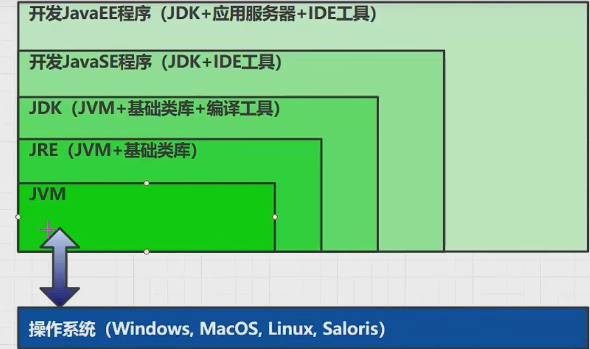
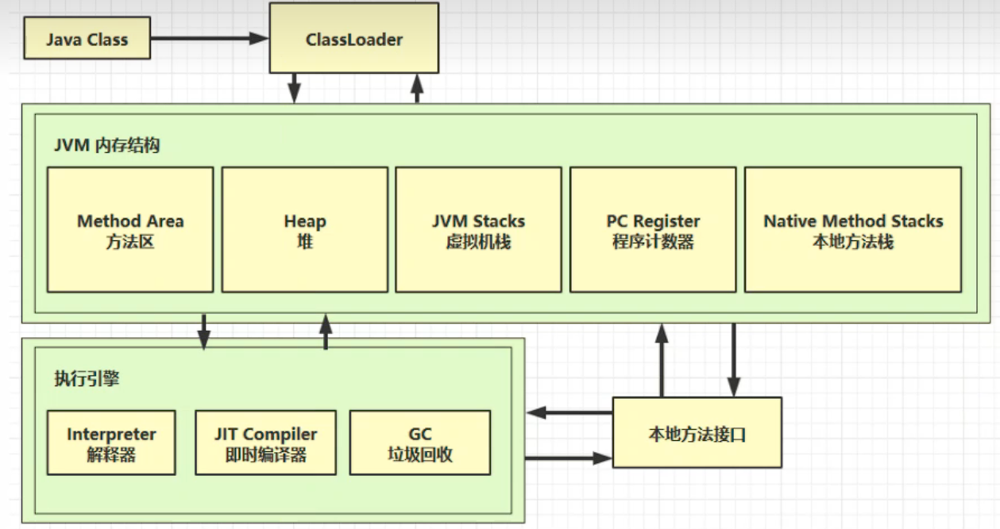
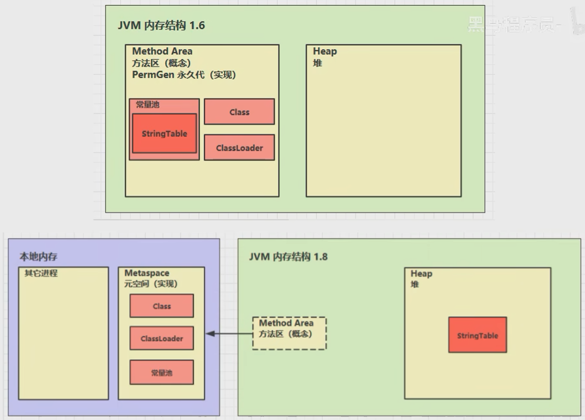
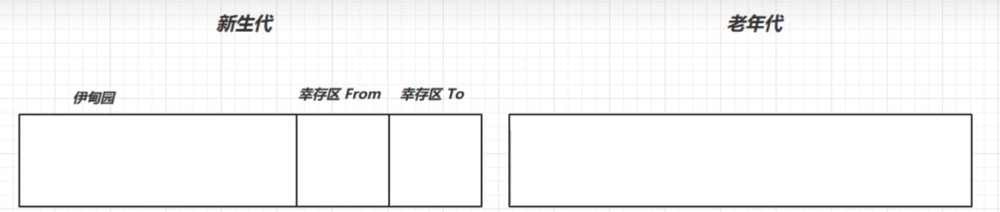
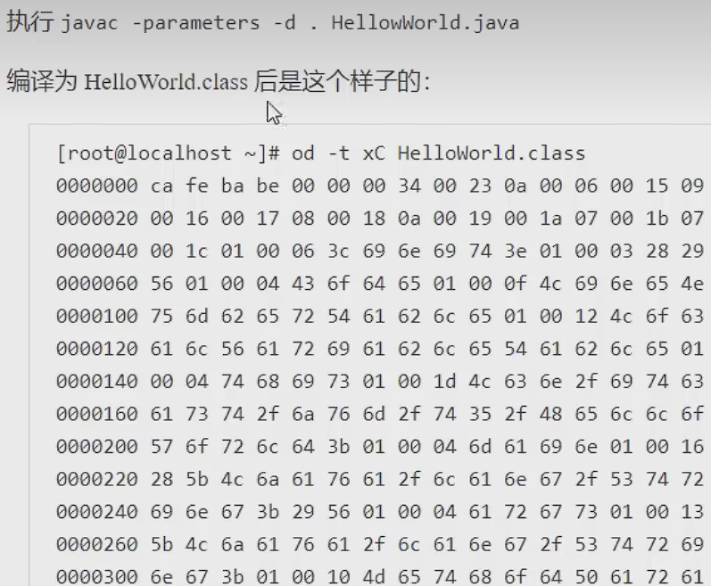
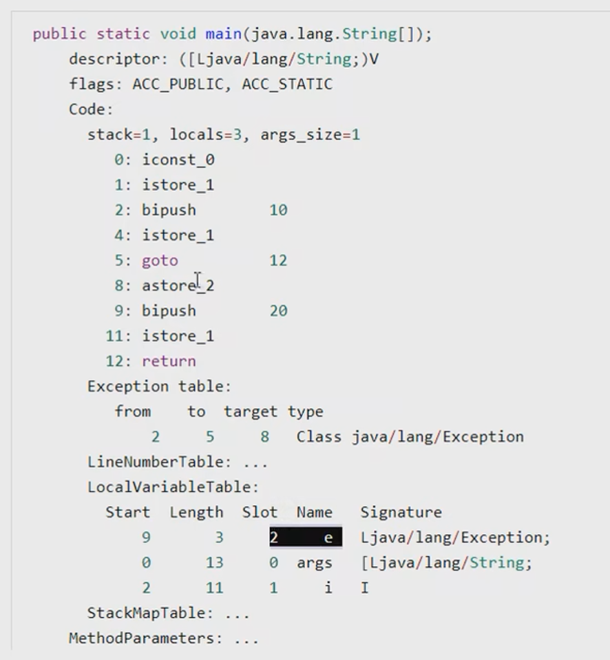
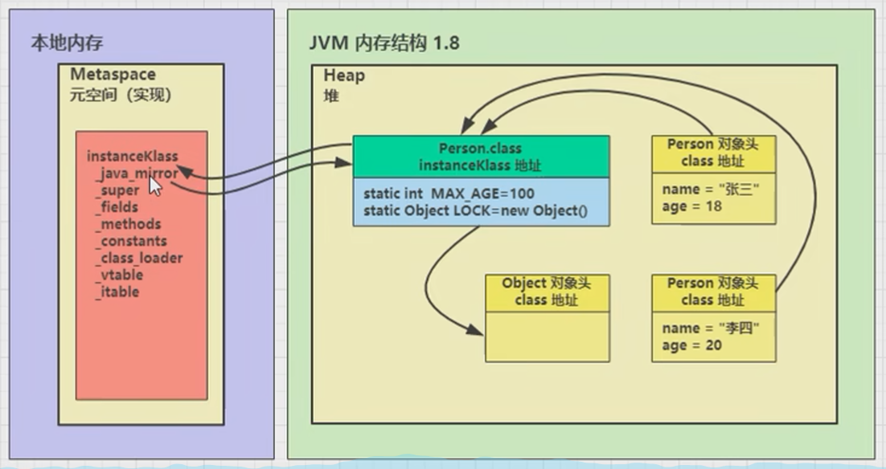

### 参考资料

> 视频：https://www.bilibili.com/video/BV1yE411Z7AP?share_source=copy_web&vd_source=6164cc1e15b15d47186e6ecfe12edef8
>
> 《深入理解Java虚拟机》

### JVM

> Java二进制字节码的运行环境（目前学习的HotSpot）

#### 优点

- 一次编写，到处运行。（不同操作系统，拥有不同的java虚拟机）

- 自动内存管理，垃圾回收功能。

- 数组下标越界检查

- 多态

#### 比较



### JVM架构



#### 程序计数器（寄存器）

> 它是一块较小的内存空间，负责记住下一条jvm指令的执行地址。

**特点**

- 线程私有

- 不会存在内存溢出

#### 栈

> 先进后出；线程运行需要的内存空间，主要负责存储栈帧，生命周期与线程相同；

**栈帧**：每个方法在执行的同时都会创建一个栈帧，用于存储局部变量表、操作数栈、动态链接、方法出口等信息。

每个线程只能有一个活动栈帧，对应当前正在执行的方法。

**问题辨析**

1. 垃圾回收是否涉及栈内存?

   不回收

2. 栈内存分配越大越好吗?

   -Xss size（使用此设置，分配内存）

   物理内存大小固定，栈内存占用太多会造成线程运行数目减小。

3. 方法内的局部变量是否线程安全?

   方法内局部变量没有逃离方法的作用范围，它是线程安全

   如果是局部变量引用了对象，并逃离了方法的作用范围，需要考虑线程安全问题

**栈内存溢出**

1. 函数递归调用（栈帧过多）->java.lang.StackOverflowError

2. 栈帧过大

**线程运行诊断**

1. cpu占用过多（Linux下分析小案例）

> 定位
>
> - 用top定位哪个进程对cpu的占用过高
> - ps H -eo pid,tid,%cpu | grep 进程id （用ps命令进一步定位是哪个线程引起的cpu占用过高）
> - jstack 进程id （可以根据线程id找到有问题的线程，进一步定位到问题代码的源码行数）

2. 迟迟得不到结果

> jstack 进程id

#### 本地方法栈

> 本地方法栈就是为虚拟机使用的Native方法服务，它与虚拟机栈类似（虚拟机栈为虚拟机执行Java方法服务）

#### Heap堆

> 通过new关键字创建的对象都会使用堆内存

**特点**

1. 它是线程共享的，堆中对象都需要考虑线程安全的问题
2. 有垃圾回收机制

**堆内存溢出**

java.lang.OutOfMemoryError

#### 堆内存诊断

1. jps工具
   查看当前系统中有哪些java进程

2. jmap工具
    jmap -heap 进程id  查看堆内存占用情况
3. jconsole工具
    图形界面的，多功能的监测工具，可以连续监测

**案例**
垃圾回收后，内存占用仍然很高？

通过jvisualvm图形化工具，点击**堆 dump**截取堆的当前数据快照。然后查看内存占用最大的那些对象

#### 方法区

> 方法区与Java堆一样，是各个线程共享的内存区域，它用于存储已被虚拟机加载的类信息、常量、静态变量、即时编译器编译后的代码数据。目前看1.8



**方法区内存溢出**

java.lang.OutOfMemoryError: Metaspace

##### 运行时常量池

>1. 常量池，就是一张表，虚拟机指令根据这张常量表找到要执行的类名、方法名、参数类型、字面量等信息。
>2. 运行时常量池，常量池是*.class文件中的，当该类被加载，它的常量池信息就会放入运行时常量池，并把里面的符号地址变为真实地址。

##### StringTable

>StringTable是一个固定大小的**Hashtable**，由数组和链表组成，数组又称为桶数组，默认值大小长度是1009。
>
>如果放进StringTable的String非常多，就会造成Hash冲突严重，从而导致链表会很长，而链表长了后直接会造成的影响就是当调用String.intern()方法时性能会大幅下降。

**面试题**

```java
javap -v .class //反编译

//将字符串对象放入StringTable中
String s1 = "a";
String s2 = "b";
String s5 = "ab";
//放到堆中
String s4 = s1 + s2;//new StringBuilder().append("a").append("b").toString() -> new String()
//StringTable中找“ab”
String s3 = "a" + "b";//javac 在编译期间的优化，结果已经在编译器确定为ab

String s6 = s4.intern();
//问
System.out.println(s3 == s4);//false
System.out.println(s3 == s5);//true
System.out.println(s3 == s6);//true


String x2 = new String("c") + new String("d");
String x1 = "cd";
x2.intern();//将这个字符串对象尝试放入串池，如果有则不会放入，如果没有则放入串池，会把串池的对象放回
//如果交换上面2行，则下面结果全为true
System.out.println(x1 == x2);//false
System.out.println(x2 == "cd");//false
System.out.println(x1 == "cd");//true
```

从该视频开始看： https://www.bilibili.com/video/BV1yE411Z7AP?p=28&share_source=copy_web&vd_source=6164cc1e15b15d47186e6ecfe12edef8

**StringTable**特性

常量池中的字符串仅是符号，第一次用到时才变为对象

- 利用串池的机制，来避免重复创建字符串对象
- 字符串**变量**拼接的原理是StringBuilder (1.8)
- 字符串**常量**拼接的原理是编译期优化
- 可以使用**intern**方法，主动将字符串常量池中还没有的字符串对象放入字符串常量池

**StringTable位置**

版本1.8，StringTable位于堆（因为使用频繁，所以放在这，内存回收方便）

**StringTable垃圾回收**

**StringTable性能调优**

1. 字符串常量比较多的话，调整**-XX:StringTableSize=**足够大，可以减少hash冲突，提高StringTable性能
2. 存储字符串对象时，最好进行入池（放入字符串常量池）操作，防止字符串对象重复，占用内存。

#### 直接内存

> 直接内存（堆外内存）指的是Java应用程序通过直接方式从操作系统中申请内存。这个差别与之前的堆、栈、方法区，那些内存都是经过了虚拟化。所以严格来说，这里是指直接内存。

- 常见于NIO操作时，用于数据缓冲区（ByteBuffer）
- 分配回收成本较高，但读写性能高
- 不受JVM内存回收管理

**直接内存也会溢出**

**直接内存释放原理**

通过一个Unsafe对象释放的

**直接内存分配与回收**

>使用了Unsafe对象完成直接内存的分配回收，并且回收需要主动调用freeMemory方法
>ByteBuffer的实现类内部，使用了Cleaner (虚引用) 来监测ByteBuffer对象，一 旦ByteBuffer对象被垃
>圾回收，那么就会由ReferenceHandler线程通过Cleaner的clean方法调用freeMemory来释放直接内存

### 垃圾回收

#### 如何判断对象可以回收

##### 引用计数

> 给对象中添加一个引用计数器，每当有一个地方引用它时，计数器值就加1 ;当引用失效时，计数器值就减1 ;任何时刻计数器为0的对象就是不可能再被使用的。(python语言)
>
> 但是，至少主流的Java虚拟机里面没有选用引用计数算法来管理内存，其中最主要的原因是它很难解决对象
> 之间相互循环引用的问题。

##### 可达性分析算法

>在主流的商用程序语言( Java、C# ，甚至包括前面提到的古老的Lisp )的主流实现中，都是称通过可达性分析( Reachability Analysis )来判定对象是否存活的。
>
>这个算法的基本思路就是通过一系列的称为“GC Roots”的对象作为起始点，从这些节点开始向下搜索，搜索所走过的路径称为引用链( Reference Chain)，当 一个对象到GC Roots没有任何引用链相连(用图论的话来说，就是从GC Roots到这个对象不可达)时，则证明此对象是不可用的。所以它将会被判定为是可回收的对象。

##### 五种引用

1. 强引用
   只有所有GC Roots对象都不通过[强引用]引用该对象，该对象才能被垃圾回收

2. 软引用(SoftReference)
   仅有软引用引用该对象时，在垃圾回收后，内存仍不足时会再次出发垃圾回收，回收软引用对象可以配合引用队列来释放软引用自身

   ```java
   	private static int _10M = 1014 * 1024 * 10;//这是一个10M的字节空间
       private static int _4M = 1014 * 1024 * 4;//这是一个4M的字节空间
   
       public static void main(String[] args) {
           SoftReference<byte[]> softReference;
           List<SoftReference> list = new ArrayList<>();
           //引用队列
           ReferenceQueue<byte[]> referenceQueue = new ReferenceQueue<>();
   
           System.out.println("------当前为软引用------------");
           for (int i = 0; i < 4; i++){
               //关联了引用队列，当软引用所关联的byte[]被回收时,软引用自己会加入到queue中去
               softReference = new SoftReference<>(new byte[_4M], referenceQueue);
               list.add(softReference);
               System.out.println(list.size());
           }
           //移除无用的软引用对象
           Reference<? extends byte[]> poll = referenceQueue.poll();
           while (poll != null) {
               list.remove(poll);
               poll = referenceQueue.poll();
           }
           System.out.println("----------下面是输出-------------");
           for (SoftReference<byte[]> ref : list ){
               System.out.println(ref.get());
           }
       }
   ```

3. 弱引用(WeakReference)
   仅有弱引用引用该对象时，在垃圾回收时，无论内存是否充足，都会回收弱引用对象可以配合引用队列来释放弱引用自身

   ```java
   	private static int _10M = 1014 * 1024 * 10;//这是一个10M的字节空间
       private static int _4M = 1014 * 1024 * 4;//这是一个4M的字节空间
   
       public static void main(String[] args) {
           WeakReference<byte[]> bytes;
           List<WeakReference> list = new ArrayList<>();
           for (int i = 0;i < 4; i++){
               bytes = new WeakReference<>(new byte[_4M]);
               list.add(bytes);
               for (WeakReference w : list) {
                   System.out.print(w.get() + " ");
               }
               System.out.println();
           }
           //回收无用的弱引用，同上
       }
   ```

4. 虚引用(PhantomReference)
   必须配合引用队列使用，主要配合ByteBuffer使用，被引用对象回收时，会将虚引用入队，由Reference Handler线程调用虚引用相关方法释放直接内存

5. 终结器引用(FinalReference)
   无需手动编码，但其内部配合引用队列使用，在垃圾回收时，终结器引用入队(被引用对象暂时没有被回收)，再由Finalizer 线程通过终结器引用找到被引用对象并调用它的finalize方法，第二次GC时才能回收被引用对象

#### 回收算法

##### 标记清除

>最基础的收集算法是“标记-清除”( Mark-Sweep )算法，如同它的名字一样，算法分为“标记”和“清除’两个阶段:首先标记出所有需要回收的对象,在标记完成后统一回收所有被标记的对象，它的标记过程其实在前一节讲述对象标记判定时已经介绍过了。之所以说它是最基础的收集算法，是因为后续的收集算法都是基于这种思路并对其不足进行改进而得到的。

**它的主要不足有两个:**

一个是效率问题，标记和清除两个过程的效率都不高;

另一个是空间问题，标记清除之后会产生大量不连续的内存碎片，空间碎片太多可能会导致以后在程
序运行过程中需要分配较大对象时，无法找到足够的连续内存而不得不提前触发另一次垃圾收集动作。

##### 标记整理

>复制收集算法在对象存活率较高时就要进行较多的复制操作，效率将会变低。更关键的是，如果不想浪费50%的空间，就需要有额外的空间进行分配担保，以应对被使用的内存中所有对象都100%存活的极端情况，所以在老年代一般不能直接选用这种算法。
>
>根据老年代的特点，有人提出了另外一种“标记-整理”( Mark-Compact )算法，标记过程仍然与“标记-清除”算法一样，但后续步骤不是直接对可回收对象进行清理，而是让所有存活的对象都向一端移动，然后直接清理掉端边界以外的内存。

##### 复制

>它将可用内存按容量划分为大小相等的两块，每次只使用其中的一块。当这一块的内存用完了，就将还存活着的对象复制到另外一块上面，然后再把已使用过的内存空间一次清理掉。这样使得每次都是对整个半区进行内存回收，内存分配时也就不用考虑内存碎片等复杂情况，只要移动堆顶指针，按顺序分配内存即可，实现简单，运行高效只是这种算法的代价是将内存缩小为了原来的一半，未免太高了一点。

速度比标记整理快，内存空间连续，但会占用双倍内存空间

##### 分代回收

>当前商业虚拟机的垃圾收集都采用“分代收集”(GenerationalCollection)算法，这种算法并没有什么新的思想，只是根据对象存活周期的不同将内存划分为几块。一般是把Java堆分为新生代和老年代，这样就可以根据各个年代的特点采用最适当的收集算法。
>
>在**新生代**中，每次垃圾收集时都发现有大批对象死去，只有少量存活，那就选用**复制**算法，只需要付出少量存活对象的复制成本就可以完成收集。
>
>而**老年代**中因为对象存活率高、没有额外空间对它进行分配担保，就必须使用“**标记一清理**”或者“**标记一整理** ”算法来进行回收。



- 对象首先分配在伊甸园区域
- 新生代空间不足时，触发minor gc, 伊甸园和 from 存活的对象使用 copy 复制到 to 中，存活的对象年龄加
  1并且交换 from to 指向
- minor gc会引发stop the world（STW)，暂停其它用户的线程，等垃圾回收结束，用户线程才恢复运行
- 当对象寿命超过阈值时，会晋升至老年代，最大寿命是15 (4bit)

- 当老年代空间不足，会先尝试触发minor gc，如果之后空间不足，那么触发full gc，STW的时间更长。

**相关VM参数**

| 含义              | 参数                                                         |
| ----------------- | ------------------------------------------------------------ |
| 堆初始大小        | -Xms                                                         |
| 堆最大大小        | -Xmx 或 -XX:MaxHeapSize=size                                 |
| 新生代大小        | -Xmn 或 (-XX:NewSize=size + -XX:MaxNewSize=size )            |
| 幸存区比例(动态)  | -XX:InitialSurvivorRatio=ratio 和 -Xx:+UseAdaptiveSizePolicy |
| 幸存区比例        | -XX+SurvivorRatio=ratio                                      |
| 晋升阈值          | -XX:MaxTenuringThreshold=threshold                           |
| 晋升详情          | -XX:+PrintTenuringDistribution                               |
| GC详情            | -XX:+PrintGCDetails -verbose:gc                              |
| FullGC 前 MinorGC | -XX:+ScavengeBeforeFullGC                                    |

新声明的**大对象**新生代放不下，当老年代放得下时，直接晋升放到老年代。

#### 垃圾回收器

##### Serial收集器（串行）

>Serial收集器是最基本、发展历史最悠久的收集器，采用**复制**算法，曾经(在JDK 1.3.1之 前)是虚拟机新生代收集的唯一选择。大家看名字就会知道，这个收集器是一个**单线程的收集器**，但它的“单线程”的意义并不仅仅说明它只会使用一个CPU或一条收集线程去完成垃圾收集工作，更重要的是在它进行垃圾收集时，必须暂停其他所有的工作线程，直到它收集结束。“StopThe World”这 个名字也许听起来很酷，但这项工作实际上是由虚拟机在后台自动发起和自动完成的，在用户不可见的情况下把用户正常工作的线程全部停掉，这对很多应用来说都是难以接受的。读者不妨试想一下，要是你的计算机每运行一个小时就会暂停响应5分钟，你会有什么样的心情?

它也有着优于其他收集器的地方：

简单而高效(与其他收集器的单线程比)，对于限定单个CPU的环境来说，Serial收集器由于没有线程交互的开销，专心做垃圾收集自然可以获得最高的单线程收集效率。在用户的桌面应用场景中，分配给虚拟机管理的内存一般来说不会很大，收集几十兆甚至一两百兆的新生代(仅仅是新生代使用的内存，桌面应用基本上不会再大了) ，停顿时间完全可以控制在几十毫秒最多一百多毫秒以内，只要不是频繁发生，这点停顿是可以接受的。所以，Serial收集器对于运行在Client模式下的虚拟机来说是一个很好的选择。

使用串行收集器参数：-XX:+UseSerialGC= Serial + Serial0ld

##### Parallel Scavenge收集器

> 也经常称为“吞吐量优先”收集器。
>
> Parallel Scavenge它是使用**复制算法**的收集器，又是并行的多线程收集器。
>
> ParallelScavenge收集器的目标则是达到一个可控制的吞吐量(Throughput)。所谓吞吐量就是CPU用于运行用户代码的时间与CPU总消耗时间的比值，即吞吐量=运行用户代码时间/(运行用户代码时间+垃圾收集时间)，虛拟机总共运行了100分钟，其中垃圾收集花掉1分钟，那吞吐量就是99%。

使用吞吐量优先收集器参数：

-XX:+UseParallelGC ~ -XX: +UseParallel0ldGC 

-XX:+UseAdaptiveSizePolicy #动态调整内存大小

XX:GCTimeRatio=ratio #调整吞吐量

XX :MaxGCPauseMillis=ms #调整垃圾回收，STW时间

XX:ParallelGCThreads=n

#####  CMS(Concurrent Mark Sweep)收集器

> CMS(Concurrent Mark Sweep)收集器是一种以获取最短回收停顿时间为目标的收集器。
>
> 也叫响应时间优先收集器
>
> 目前很大一部分的Java应用集中在互联网站或者B/S系统的服务端上, 这类应用尤其重视服务的响应速度，希望系统停顿时间最短，以给用户带来较好的体验。CMS收集器就非常符合这类应用的需求。

从名字(包含“Mark Sweep”) 上就可以看出，CMS收集器是基于“标记一 清除”算法实现的，它的运作过程相对于前面几种收集器来说更复杂一些，整个过程分为4个步骤, 包括:

1. 初始标记(CMS initial mark)
2. 并发标记(CMS concurrent mark)
3. 重新标记(CMS remark)
4. 并发清除(CMS concurrent sweep)

其中，初始标记、重新标记这两个步骤仍然需要“Stop The World”。 初始标记仅仅只是标记一下GC Roots能直接关联到的对象，速度很快，并发标记阶段就是进行GC RootsTracing的过程，而重新标记阶段则是为了修正并发标记期间因用户程序继续运作而导致标记产生变动的那一部分对象的标记记录，这个阶段的停顿时间一般会比初始标记阶段稍长一些，但远比并发标记的时间短。

使用响应时间优先参数：

-XX:+UseConcMarkSweepGC ~ -XX: +UseParNewGC ~ Serial0ld

-XX:ParallelGCThreads=n ~ -XX:ConcGCThreads=threads

-XX:CMSInitiatingOccupancyFraction=percent

XX: +CMSScavengeBeforeRemark #先gc年轻代

##### G1收集器

> 基于 “标记-整理” 算法，收集后不会产生内存碎片。
>
> 可以非常精确控制停顿时间，在不牺牲吞吐量前提下，实现低停顿垃圾回收。

G1垃圾收集器的内存模型：

G1 收集器不采用传统的新生代和老年代物理隔离的布局方式，仅在逻辑上划分新生代和老年代，将整个堆内存划分为2048个大小相等的独立内存块Region，每个Region是逻辑连续的一段内存，具体大小根据堆的实际大小而定，整体被控制在 1M - 32M 之间，且为2的N次幂（1M、2M、4M、8M、16M和32M），并使用不同的Region来表示新生代和老年代，G1不再要求相同类型的Region在物理内存上相邻，而是通过Region的动态分配方式实现逻辑上的连续。

G1收集器通过跟踪Region中的垃圾堆积情况，每次根据设置的垃圾回收时间，回收优先级最高的区域，避免整个新生代或整个老年代的垃圾回收，使得stop the world的时间更短、更可控，同时在有限的时间内可以获得最高的回收效率。
通过区域划分和优先级区域回收机制，确保G1收集器可以在有限时间获得最高的垃圾收集效率。

与其他GC收集器相比，G1具备如下特点。

1. 并行与并发：G1能充分利用多CPU、多核环境下的硬件优势，使用多个CPU( CPU或者CPU核心)来缩短Stop-The-World停顿的时间，部分其他收集器原本需要停顿Java线程执行的GC动作，G1收集器仍然可以通过并发的方式让Java程序继续执行。
2. 分代收集：与其他收集器一样，分代概念在G1中依然得以保留。虽然G1可以不需要其他收集器配合就能独立管理整个GC堆，但它能够采用不同的方式去处理新创建的对象和已经存活了一段时间、熬过多次GC的旧对象以获取更好的收集效果。
3. 空间整合：与CMS的“标记一清理”算法不同，G1从整体来看是基于“标记一整理”算法实现的收集器，从局部(两个Region之间)上来看是基于“复制”算法实现的，但无论如何，这两种算法都意味着G1运作期间不会产生内存空间碎片，收集后能提供规整的可用内存。 这种特性有利于程序长时间运行，分配大对象时不会因为无法找到连续内存空间而提前触发下一次GC。
4. 可预测的停顿：这是G1相对于CMS的另一大优势，降低停顿时间是G1和CMS共同的关注点，但G1除了追求低停顿外，还能建立可预测的停顿时间模型，能让使用者明确指定在一个长度为M毫秒的时间片段内，消耗在垃圾收集上的时间不得超过N毫秒，这几乎已经是实时Java(RTSJ)的垃圾收集器的特征了。

使用G1收集器参数：

-XX: +UseG1GC

-XX: G1HeapRegionSize=size

-XX :MaxGCPauseMillis=time

**G1垃圾回收阶段**

1. **Young Collection**

新生代内存紧张通过复制到幸存区，然后幸存区晋升到老年代或再次进入新生代

新生代跨代引用（老年代引用新生代）问题：

​	利用卡表

2. **Young Collection + CM**

   在Young GC时会进行GC Root的初始标记

   老年代占用堆空间比例达到阈值时，进行并发标记(不会STW) ，由下面的JVM参数决定

   -XX: InitiatingHeapOccupancyPercent=percent (默认45%)#老年代占比45%就进行并发标记

3. **Mixed Collection**

   会对E、S、O进行全面垃圾回收

   最终标记(Remark) 会STW

   拷贝存活(Evacuation) 会STW

-XX:MaxGCPauseMillis=ms

##### Full GC

1. SerialGC

   新生代内存不足发生的垃圾收集- minor gc

   老年代内存不足发生的垃圾收集- full gc

2. ParallelGC
   新生代内存不足发生的垃圾收集- minor gc
   老年代内存不足发生的垃圾收集- full gc

3. CMS
   新生代内存不足发生的垃圾收集- minor gc
   老年代内存不足
4. G1
   新生代内存不足发生的垃圾收集- minor gc
   老年代内存不足（处于并发收集阶段，回收速度大于垃圾产生速度，它不是full gc）

### 垃圾回收调优

查看虚拟机运行参数
java -XX:+PrintFlagsFinal -version | findstr "GC"

1. 选择合适的回收器。

高吞吐量选择ParallelGC，低延迟选择CMS、G1。

### 类加载器


#### 类文件结构

98~100集



1. **魔术**

标记这是一个java文件 **ca fe ba be**

	2. **版本**

接下来四个字节是版本信息 **00 00 00 34**

3. **常量池**

8~9字节，表示常量池长度 **00 23**（35）表示常量池有#1~#34项，注意#0项不计入，也没有值。

第#1项0a表示一个Method信息，00 06 和00 15 (21)表示它引用了常量池中#6和#21项来获得这个方法的[所
属类]和[方法名]。

第#2项09表示一个Field信息，00 16 (22) 和00 17 (23) 表示它引用了常量池中#22和# 23项来获得这个成员变
量的[所属类]和[成员变量名]。

......

4. **访问标识与继承信息**

5. **field**
6. **Method信息**
7. **附加属性**

#### javap工具

> 反编译class文件
>
> javap -v .class

#### 字节码执行流程

1. 常量池载入运行时常量池
2. main方法字节码指令会放在方法区
3. main线程开始运行，分配栈帧内存。
4. ......

#### 多态原理

使用工具HSDB

vtable：虚方法表，存放多态方法

**当执行invokevirtual指令时：**

1. 先通过栈帧中的对象引用找到对象
2. 分析对象头，找到对象的实际Class

3. Class结构中有vtable，它在类加载的链接阶段就已经根据方法的重写规则生成好了
4. 查表得到方法的具体地址
5. 执行方法的字节码

#### 异常



1. 查看Exception table这个结构，[from, to)是前闭后开的检测范围，一旦这个范围内的字节码
   执行出现异常，则通过type匹配异常类型，如果一致， 进入target所指示行号。

2. 异常局部变量，共用一个槽位。

### 语法糖

>所谓的语法糖，其实就是指java编译器把\*. java源码编译为*. class字节码的过程中，自动生成和转换的
>一些代码， 主要是为了减轻程序员的负担，算是java编译器给我们的一个额外福利(给糖吃嘛)。

#### 默认构造方法

#### 自动拆装箱

#### 泛型集合取值

1. 泛型擦除
2. 泛型反射

#### 可变参数

#### Foreach循环

#### SWITCH 字符串

#### SWITCH 枚举

#### try-catch-finally

#### 方法重写时的桥接方法

#### 匿名内部类

### 类加载

#### 加载

将类的字节码载入方法区中，内部采用C++的instanceKlass描述java类，它的重要field有:

- _java_mirror即java的类镜像，例如对String来说，就是String.class, 作用是把klass暴露给java使用
- _super即父类
- fields即成员变量
- _methods即方法
- _constants 即常量池
- _class_loader即类加载器
- _vtable虛方法表
- _itable接口方法表

如果这个类还有父类没有加载，先加载父类

加载和链接可能是交替运行的

**注意:** instanceKlass这样的[元数据]是存储在方法区(1.8后的元空间内)， 但_java_mirror是存储在堆中
可以通过前面介绍的HSDB工具查看



#### 链接

**验证**

> 验证类是否符合JVM规范，安全性检查

**准备**

> 为static变量分配空间，设置默认值

- static变量在JDK 7之前存储于instanceKlass末尾，从JDK 7开始，存储于_java_mirror末尾
- static变量分配空间和赋值是两个步骤，分配空间在准备阶段完成，赋值在初始化阶段完成
- 如果static变量是final的基本类型，以及字符串常量，那么编译阶段值就确定了，赋值在准备阶段完成
- 如果static变量是final的，但属于引用类型，那么赋值也会在初始化阶段完成

**解析**

> 将常量池中的符号引用解析为直接引用，就能知道类、方法或属性的位置。

#### 初始化

> 初始化即调用<cinit>()V，虚拟机会保证这个类的（构造方法）的线程安全

概括得说，类初始化是[懒惰的]

- main方法所在的类，总会被首先初始化
- 首次访问这个类的静态变量或静态方法时
- 子类初始化，如果父类还没初始化，会引发
- 子类访问父类的静态变量，只会触发父类的初始化
- Class.forName
- new会导致初始化

不会导致类初始化的情况

- 访问类的static final静态常量(基本类型和字符串)不会触发初始化
- 类对象.class不会触发初始化
- 创建该类的数组不会触发初始化
- 类加载器的loadClass方法
- Class.forName 的参数2为false 时

#### 类加载器

以JDK8为例：

| 名称                    | 加载哪的类            | 说明                        |
| ----------------------- | --------------------- | --------------------------- |
| Bootstrap ClasLoader    | JAVA_HOME/jre/lib     | 无法直接访问                |
| Extension ClassLoader   | JAVA_HOME/jre/lib/ext | 上级为Bootstrap，显示为null |
| Application ClassLoader | classpath             | 上级为Extension             |
| 自定义类加载            | 自定义                | 上级为Application           |

**启动类加载器**

```java
jvm> java -Xbootclasspath/a:. 全类名
-Xbootclasspath表示设置bootclasspath之后
其中/a:.表示将当前目录追加至bootclasspath之后
可以用这个办法替换核心类
    java -Xbootclasspath:<new bootclasspath>
    java -Xbootclasspath/a:<追加路径>
    java -Xbootclasspath/p:<追加路径>
```

**扩展类加载器**

**双亲委派模式**

**线程上下文类加载器**

> 线程上下文类加载器是当前线程使用的类加载器，默认就是应用程序类加载器，它内部又是由Class. forName调用了线程上下文类加载器完成类加载，具体代码在ServiceLoader的内部类LazyIterator中。

**自定义类加载器**

问问自己，什么时候需要自定义类加载器

- 想加载非classpath随意路径中的类文件
- 都是通过接口来使用实现，希望解耦时，常用在框架设计
- 这些类希望予以隔离，不同应用的同名类都可以加载，不冲突，常见于tomcat容器

步骤:

1. 继承ClassLoader父类

2. 要遵从双亲委派机制，重写findClass方法

   注意不是重写loadClass方法，否则不会走双亲委派机制

3. 读取类文件的字节码

4. 调用父类的defineClass方法来加载类

5. 使用者调用该类加载器的loadClass方法

### 运行期优化

**逃逸分析**

**方法内联**

**字段优化**

**反射优化**

### JMM（内存模型）

>简单的说，JMM定义了一套在多线程读写共享数据时(成员变量、数组)时，对数据的可见性、有序性、
>和原子性的规则和保障

#### 原子性

利用synchronized(同步关键字)，保证原子性。

Java的内存模型如下，完成静态变量的自增，自减需要在主存和线程内存中进行数据交换。

#### 可见性

**volatile (易变关键字)**
它可以用来修饰成员变量和静态成员变量，他可以避免线程从自己的工作缓存中查找变量的值，必须到主存
中获取它的值，线程操作volatile变量都是直接操作主存。

前面例子体现的实际就是可见性，它保证的是在多个线程之间，一个线程对volatile变量的修改对另一个线
程可见，**不能保证原子性，仅用在一个写线程， 多个读线程的情况**。

synchronized语句块既可以保证代码块的原子性，也同时保证代码块内变量的可见性。但缺点是synchronized是属于重量级操作，性能相对更低。

#### 有序性

*指令重排？*

volatile修饰变量，可以禁用指令重排

指令重排是种优化，但**在多线程情况下指令重排会影响正确性**。

happens-before

happens-before规定了哪些写操作对其它线程的读操作可见，它是可见性与有序性的一套规则总结。

#### CAS

CAS即Compare and Swap，它体现的一种**乐观锁**的思想，比如多个线程要对一个共享的整型变量执行+1操做。

获取共享变量时，为了保证该变量的可见性，需要使用volatile修饰。结合CAS和volatile可以实现无锁并发，适用于**竞争不激烈、多核CPU**的场景下。

- 因为没有使用synchronized，所以线程不会陷入阻塞，这是效率提升的因素之一
- 但如果竞争激烈，可以想到重试必然频繁发生，反而效率会受影响

CAS底层依赖于一个Unsafe类来直接调用操作系统底层的CAS指令。

##### 原子类

juc (java.util.concurrent) 中提供了原子操作类，可以提供线程安全的操作，例如: AtomicInteger、
AtomicBoolean等，它们底层就是采用CAS技术+ volatile来实现的。

##### 乐观锁与悲观锁
CAS是基于乐观锁的思想: 最乐观的估计，不怕别的线程来修改共享变量，就算改了也没关系，我吃亏
点再重试呗。
synchronized 是基于悲观锁的思想: 最悲观的估计，得防着其它线程来修改共享变量，我上了锁你们都别
想改，我改完了解开锁，你们才有机会。

#### synchronized

Java HotSpot虚拟机中，每个对象都有对象头(包括class指针和Mark Word)。Mark Word平时存储这个对象的哈希码、分代年龄，当加锁时，这些信息就根据情况被替换为标记位、线程锁记录指针、重量级锁指针、线
程ID等内容。

##### 轻量级锁

如果一个对象虽然有多线程访问，但多线程访问的时间是错开的(也就是没有竞争) ，那么可以使用轻量级
锁来优化。

##### 锁膨胀

如果在尝试加轻量级锁的过程中，CAS操作无法成功，这时一种情况就是有其它线程为此对象加上了轻量级
锁(有竞争)，这时需要进行锁膨胀，将轻量级锁变为重量级锁。

##### 重量级锁

重量级锁竞争的时候，还可以使用自旋来进行优化，如果当前线程自旋成功(即这时候持锁线程已经退出了
同步块，释放了锁，这时当前线程就可以避免阻塞。
在Java 6之后自旋锁是自适应的，比如对象刚刚的一次自旋操作成功过，那么认为这次自旋成功的可能性会
高，就多自旋几次；反之，就少自旋甚至不自旋，总之，比较智能。

- 自旋会占用CPU时间，单核CPU自旋就是浪费，多核CPU自旋才能发挥优势。
- 好比等红灯时汽车是不是熄火，不熄火相当于自旋(等待时间短了划算)，熄火了相当于阻塞(等待时间
  长了划算)
- Java 7之后不能控制是否开启自旋功能

##### 偏向锁

轻量级锁在没有竞争时(就自己这个线程)，每次重入仍然需要执行CAS操作。Java 6中引入了偏向锁来做
进一步优化：只有第一次使用CAS将线程ID设置到对象的Mark Word头，之后发现这个线程ID是自己的
就表示没有竞争，不用重新CAS。

- 撤销偏向需要将持锁线程升级为轻量级锁,这个过程中所有线程需要暂停(STW)
- 访问对象的hashCode也会撤销偏向锁
- 如果对象虽然被多个线程访问，但没有竞争，这时偏向了线程T1的对象仍有机会重新偏向T2，重偏向会重置对象的Thread ID
- 撤销偏向和重偏向都是批量进行的，以类为单位
- 如果撤销偏向到达某个阈值，整个类的所有对象都会变为不可偏向的
- 可以主动使用-XX:UseBiasedLocking禁用偏向锁

##### 其他优化

**减少上锁时间**

同步代码块中尽量短

**减少锁的粒度**

将一个锁拆分为多个锁提高并发度

**锁粗化**

多次循环进入同步块不如同步块内多次循环
另外JVM可能会做如下优化，把多次append的加锁操作粗化为一次(因为都是对同一个对象加锁，没必要重入多次)

**锁消除**

JVM会进行代码的逃逸分析，例如某个加锁对象是方法内局部变量，不会被其它线程所访问到，这时候就会
被即时编译器忽略掉所有同步操作。

**读写分离**