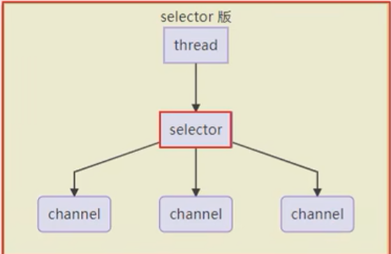

### 参考资料

> https://www.bilibili.com/video/BV1py4y1E7oA?p=4&share_source=copy_web&vd_source=6164cc1e15b15d47186e6ecfe12edef8

### NIO基础

non-blocking io 非阻塞IO

#### 三大组件

##### Channel & Buffer

channel有一点类似于 stream，它就是读写数据的双向通道，可以从channel将数据读入buffer，也可以将
buffer的数据写入channel，而之前的stream要么是输入，要么是输出，channel比stream更为底层。

常见的Channel有

- FileChannel
- DatagramChannel
- SocketChannel
- ServerSocketChannel

buffer则用来缓冲读写数据，常见的buffer有

- ByteBuffer
  - MappedByteBuffer
  - DirectByteBuffer
  - HeapByteBuffer

##### Selector

**多线程**版本缺点

1. 内存占用高
2. 线程上下文切换成本高
3. 只适合连接数少的场景

**线程池**版缺点

1. 阻塞模式下，线程仅能处理一个socket连接
2. 仅适合短连接场景

**selector**版设计



selector的作用就是配合一个线程来管理多个channel，获取这些channel上发生的事件，这些channel工作在
**非阻塞**模式下，不会让线程吊死在一个channel上。适合连接数特别多，但流量低的场景(low traffic)。

调用selector的select()会阻塞直到channel发生了读写就绪事件，这些事件发生，select 方法就会返回这些事
件交给thread来处理。

```java
import lombok.extern.slf4j.Slf4j;
import java.io.IOException;
import java.net.InetSocketAddress;
import java.nio.ByteBuffer;
import java.nio.channels.*;
import java.util.Iterator;
import java.util.concurrent.ConcurrentLinkedQueue;
import java.util.concurrent.atomic.AtomicInteger;

/**
 * selector
 */
@Slf4j
public class MyServer {


    public static void main(String[] args) {
        Thread.currentThread().setName("boss");
        //创建selector，管理多个channel
        try(Selector boss = Selector.open();
            ServerSocketChannel serverSocket = ServerSocketChannel.open()) {
            serverSocket.configureBlocking(false);//accept不阻塞
            //注册 channel注册到selector
            //SelectionKey 事件发生后，通过它可以知道事件和哪个channel的事件
            //事件发送后要么处理，要么取消，不能不理
            //read wirte accept connect事件
            SelectionKey bossKey = serverSocket.register(boss, 0, null);
            //key 只关注accept事件
            bossKey.interestOps(SelectionKey.OP_ACCEPT);
            log.info("register key:{}", bossKey);
            //绑定端口
            serverSocket.bind(new InetSocketAddress(9099));
            log.info("服务器正在启动......");

            //创建固定数量worker
            Worker[] workers = new Worker[3];
            for (int i = 0; i < workers.length; i++) {
                workers[i] = new Worker("worker-" + i);
            }
            AtomicInteger index = new AtomicInteger();
            while (true) {
                //select方法，没有事件发送，线程阻塞，有事件，线程才会恢复运行
                boss.select();
                //处理事件，selectedkeys 内部包含了所有发生的事件
                Iterator<SelectionKey> it = boss.selectedKeys().iterator();
                while (it.hasNext()) {
                    SelectionKey key = it.next();
                    it.remove();//处理完的key需要删除，在selectedKeys中
                    log.info("now_key: {}", key);

                    //区分事件
                    if (key.isAcceptable()) {//accept事件
                        ServerSocketChannel channel = (ServerSocketChannel) key.channel();
                        SocketChannel sc = channel.accept();
                        sc.configureBlocking(false);//设置非阻塞
                        //round robin
                        workers[index.getAndIncrement() % workers.length].register(sc);
                        log.info("accept {}", sc);
                    }

//                    else if (key.isReadable()) {//read事件
//                        try {
//                            SocketChannel channel = (SocketChannel) key.channel();
//                            //获取selectionKey 上关联的附件
//                            ByteBuffer byteBuffer_attachment = (ByteBuffer) key.attachment();
//                            int read = channel.read(byteBuffer_attachment);//正常断开，read方法返回值为-1
//                            if (read == -1) {
//                                logger.info("已断开，取消 {}", key);
//                                key.cancel();
//                            }else {
//                                byteBuffer_attachment.flip();
//                                logger.info("read {}", Charset.defaultCharset().decode(byteBuffer_attachment));
//                            }
//                        } catch (IOException e) {
//                            e.printStackTrace();
//                            key.cancel();//客户端断开了，取消key，从selector的keys集合中真正删除key
//                        }
//                    }

                }
            }
        }catch (IOException e) {
            log.error("有错误发生：", e);
        }
    }

    /**
     * 监测读写事件
     */
    static class Worker implements Runnable {
        private Thread thread;
        private Selector workerSelector;
        private String name;

        private volatile boolean start = false;//还未初始化
        ConcurrentLinkedQueue<Runnable> queue = new ConcurrentLinkedQueue<>();

        public Worker(String name) {
            this.name = name;
        }

        /**
         * 初始化线程，和selector
         * 执行一遍
         * @throws IOException
         */
        public void register(SocketChannel sc) throws IOException {
            if (!start) {
                thread = new Thread(this, name);
                workerSelector = Selector.open();
                start = true;

                thread.start();
            }
            queue.add(()->{
                try {
                    sc.register(workerSelector, SelectionKey.OP_READ, null);
                } catch (ClosedChannelException e) {
                    e.printStackTrace();
                }
            });
            workerSelector.wakeup();//唤醒
        }

        @Override
        public void run() {
            while (true) {
                try {
                    workerSelector.select();//会阻塞

                    Runnable task = queue.poll();
                    if (task != null) {
                        task.run();//执行注册代码
                    }
                    Iterator<SelectionKey> it = workerSelector.selectedKeys().iterator();
                    while (it.hasNext()) {
                        SelectionKey key = it.next();
                        it.remove();
                        if (key.isReadable()) {
                            ByteBuffer allocate = ByteBuffer.allocate(16);
                            SocketChannel channel = (SocketChannel)key.channel();
                            channel.read(allocate);
                            allocate.flip();
                            System.out.println(allocate);
                        }
                    }
                } catch (IOException e) {
                    e.printStackTrace();
                }
            }
        }
    }
}

```

#### ByteBuffer

看讲义笔记吧。

```java
ByteBuffer.allocate(10);//分配10个字节的内存，固定的，不能扩容。分配的为堆内存，读写效率低，受到GC影响
ByteBuffer.allocateDirect(10);//分配的为直接内存，读写效率高，少一次拷贝，不受GC影响，分配效率低
flip()//切换到读
clear()//切换到写
rewind()//从头开始读
mark()//标记此时位置
reset()//重置到标记位置
get(i)//position索引不变
```

**黏包，半包**

#### 文件传输

**filechannel**

> 只能工作在阻塞模式下

**Path**

**Files**

### 网络编程

#### 非阻塞&阻塞

#### 多路复用

使用**Selector**监控channel

处理**消息边界**：比如一个中文拆成了2次读取

1. 约定固定长度，空间浪费，影响网络带宽
2. 消息分隔符：\n，效率低，字符需要一个一个比较
3. type|length|data（TLV）或者length|type|data

**attachment**

**ByteBuffer大小分配**

怎么设置自适应大小。

```java
ConcurrentLinkedDeque<Runnable> queue = new ConcurrentLinkedDeque<>();
```

#### IO模型

同步阻塞、同步非阻塞、同步多路复用、异步非阻塞

- 同步:线程自己去获取结果(一个线程)
- 异步:线程自己不去获取结果，而是由其它线程送结果(至少两个线程)

#### 零拷贝

> 不许要复制数据到java缓存区，适合数量频繁的小文件传输。

DirectByteBuf

Java调用transferTo/transferFrom底层对应sendFile

主线程结束，守护线程也会结束

### Netty


#### 组件

1. **EventLoop**

**事件循环对象**

EventLoop 本质是一个**单线程执行器**（同时维护了一个 Selector），里面有 run 方法处理 Channel 上源源不断的 io 事件。

```java
    public static void main(String[] args) {
        //创建事件循环组
        EventLoopGroup group = new NioEventLoopGroup(8);//io事件，普通任务，定时任务
        //获取下一个事件循环对象
        System.out.println(group.next());
        System.out.println(group.next());
        System.out.println(group.next());

        //cpu核数
        System.out.println(NettyRuntime.availableProcessors());
        //执行普通任务
//        group.next().submit(() -> {
//            try {
//                Thread.sleep(1000);
//            } catch (InterruptedException e) {
//                e.printStackTrace();
//            }
//            logger.info("ok");
//        });
        //执行定时任务
        group.next().scheduleAtFixedRate(()->{
            logger.info("ok");
        }, 0, 1, TimeUnit.SECONDS);
        logger.info("main");
    }
```

**事件循环组**

server

```java
public static void main(String[] args) {
        //创建独立的EventLoopGroup处理耗时较长的时间
        DefaultEventLoopGroup group = new DefaultEventLoopGroup();

        //负责组织netty组件，启动服务器
        new ServerBootstrap()
                //BossEventLoop, WorkerEventLoop (包含了线程、selector)
                //boss worker
                //细分：boss只处理accept事件；worker只处理socketChannel读写事件
                .group(new NioEventLoopGroup(), new NioEventLoopGroup(2))
                //选择服务器ServerSocketChannel实现
                .channel(NioServerSocketChannel.class)
                //boss 负责处理连接；worker(child)负责处理读写；决定了worker(child)能执行哪些操作（handler）
                .childHandler(
                        //和客户端进行数据读写的通道；Initializer初始化，负责添加别的handler
                        new ChannelInitializer<NioSocketChannel>() {
                    @Override
                    protected void initChannel(NioSocketChannel ch) throws Exception {
                        //添加具体的handler
                        //ch.pipeline().addLast(new StringDecoder());//将ByteBuf 转换为字符串
                        ch.pipeline().addLast("handler 1", new StringDecoder())
                                .addLast(group, "handler 2", new ChannelInboundHandlerAdapter() {
                            @Override
                            public void channelRead(ChannelHandlerContext ctx, Object msg) throws Exception {
                                log.info("read {}", msg);
                            }
                        });
                    }
                })
                .bind(8080);
}
```

client

```java
public static void main(String[] args) throws InterruptedException {
        NioEventLoopGroup group = new NioEventLoopGroup(2);
        //启动类
        //带有Future，Promise的类型都是和异步方法配套使用，用来正确处理结果
        ChannelFuture channelFuture = new Bootstrap()
                //添加EventLoop
                .group(group)
                //选择客户端 channel实现
                .channel(NioSocketChannel.class)
                //添加处理器
                .handler(new ChannelInitializer<NioSocketChannel>() {
                    //在连接建立后被调用
                    @Override
                    protected void initChannel(NioSocketChannel ch) throws Exception {
                        ch.pipeline().addLast(new LoggingHandler(LogLevel.DEBUG));
                        ch.pipeline().addLast(new StringEncoder());
                    }
                })
                //连接到服务器
                .connect(new InetSocketAddress("localhost", 8080));//异步非阻塞
        //解决 connect 异步非阻塞问题
        //第一种方法
        channelFuture.sync();//阻塞当前，直到nio线程连接建立完毕
        Channel channel = channelFuture.channel();//代表连接对象
//                //向服务器发送数据
//        channel.writeAndFlush("hello, world");//发送数据
//        System.out.println(channelFuture);
        //第二种方法，使用addListener(回调对象) 方法异步处理结果
//        channelFuture.addListener(new ChannelFutureListener() {
//            //在nio线程连接建立好之后，会调用operationComplete
//            @Override
//            public void operationComplete(ChannelFuture channelFuture) throws Exception {
//                Channel channel = channelFuture.channel();//代表连接对象
//                logger.info("{}", channel);
//                channel.writeAndFlush("hello, world");//发送数据
//            }
//        });
        log.info("{}", channel);
        new Thread(()->{
            Scanner scanner = new Scanner(System.in);
            while (true) {
                String line = scanner.nextLine();
                if ("q".equals(line)) {
                    channel.close();//异步操作
                    break;
                }
                channel.writeAndFlush(line);
            }
        }, "input").start();
        //获取ClosedFuture对象，1)同步处理关闭 2)异步处理关闭
        ChannelFuture closeFuture = channel.closeFuture();
//        System.out.println("waiting close...");
//        closeFuture.sync();
//        log.info("处理关闭之后的操作");
        //使用addListener(回调对象) 方法异步处理结果
        closeFuture.addListener(new ChannelFutureListener() {
            @Override
            //在nio线程连接关闭之后，会调用operationComplete
            public void operationComplete(ChannelFuture channelFuture) throws Exception {
                log.debug("处理关闭之后的操作");
                group.shutdownGracefully();//拒绝接收新的任务，处理完现有的任务，然后停止
            }
        });
}
```

#### 异步

* 单线程没法异步提高效率，必须配合多线程、多核 cpu 才能发挥异步的优势
* 异步并没有缩短响应时间，反而有所增加，提高的是吞吐量
* 合理进行任务拆分，也是利用异步的关键

#### ChannelFuture

使用下面两个方法，正确调用。用来处理结果。

sync()

addListener()

**Future & Promise**

#### Handler & Pipeline

> ChannelHandler 用来处理 Channel 上的各种事件，分为入站、出站两种。所有 ChannelHandler 被连成一串，就是 Pipeline

super.channelRead(ctx, msg);（ctx.fireChannelRead(msg)）//将数据传递给下一个handler

#### ByteBuf

#### 粘包 & 半包

滑动窗口、Nagle算法造成的粘包、半包

MSS限制

本质是因为 TCP 是流式协议，消息无边界

option()全局

childOption()child连接

**解决方法**

1. 短链接

2. 定长解码器
3. 分隔符
4. LTC解码器
5. 自定义协议

```java
//帧最大长度 长度字段偏移量 长度字段字节长度 0 0
LengthFieldBasedFrameDecoder()//解决粘包 半包
```

#### 连接假死

发送心跳

#### Promise

线程间交换数据